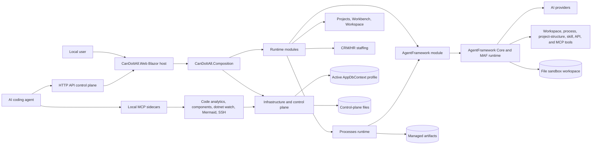

# CanDoItAll

CanDoItAll is a local-first .NET 10 Blazor Web App for project delivery work. It combines project structure, process templates and runs, workbench views, prompts, resources, validation, test evidence, activity, automation, CRM/HR staffing, AgentFramework-backed AI agents, and an HTTP API control plane in one workspace.

The current architecture is modular: `CanDoItAll.Web` hosts the app and HTTP API, `CanDoItAll.Composition` wires the runtime, `CanDoItAll.Infrastructure` owns data/storage/control-plane concerns, `CanDoItAll.Modules.*` own product behavior, `CanDoItAll.AgentFramework.*` owns technical agent execution, and `CanDoItAll.Mcp.*` exposes selected local-development sidecars. Process, project-structure, and agent operations should use the HTTP APIs and repo-managed Codex skills; the old Processes and ProjectStructure MCP servers are suppressed for now.

## Overview



## Architecture Docs

- [Architecture beta](docs/architecture-beta.md): detailed current architecture with GitHub-safe Mermaid flowcharts, C4, class, and sequence diagrams, including process execution with AI agents.
- [Docs index](docs/README.md): repository documentation map.
- [Cognitive Memory](docs/cognitive-memory/README.md): current implementation stage, architecture, API, validation, and roadmap for Cognitive Memory.
- [Enterprise operating system](docs/enterprise-operating-system.md): customer-facing explanation of CanDoItAll as an operating system for projects.
- [API control plane](docs/api-control-plane.md): current process, project-structure, project, and agent HTTP APIs.
- [Architecture index](architecture/README.md): current architecture docs, ADRs, and historical architecture reviews.
- [Shared components](docs/ui-shared-components/README.md): current shared component-library split and usage guidance.

## Requirements

- .NET 10 SDK
- Windows PowerShell for local install scripts and Playwright browser install
- Node.js and npm when rebuilding the shared Tailwind output
- `git` when installing or refreshing the portable Codex skill pack
- PostgreSQL on `127.0.0.1:5432` for the default Development/Visual Studio profile
- Qdrant on `localhost:6334` when validating Cognitive Memory vector projection or recall

## Run The Web App

From the repo root:

```powershell
dotnet run --project src/CanDoItAll.Web
```

Runtime notes:

- The app uses Blazor Interactive Server rendering.
- The default Development and Visual Studio `http`/`https` profiles use PostgreSQL database `candoitall_development` with username/password `candoitall`/`candoitall`.
- Native PostgreSQL machines can be prepared with `powershell -ExecutionPolicy Bypass -File .\tools\dev\Ensure-DevelopmentPostgres.ps1`; Docker-based clean machines can use `docker compose up -d postgres qdrant`.
- Development control-plane and workspace files are rooted under `%LOCALAPPDATA%\CanDoItAll`, not repo `.artifacts`, so a clean clone can start without carrying local artifact settings.
- Development readiness is exposed at `/_dev/runtime`.
- Development database selection is exposed at `/_dev/database/selection`.
- If no explicit `Database:Provider` and `Database:ConnectionString` override is supplied, the app resolves its active database through the control plane rooted at `%LOCALAPPDATA%\CanDoItAll\control-plane` by default.
- SQLite profiles still exist for now, but they are no longer the default development path. They are likely to be removed after more analysis because governed process runs are too slow on SQLite for this runtime.

See [Development runtime](docs/development-runtime.md) for PostgreSQL/Qdrant setup details and troubleshooting.

## Run The Development Manager

From the repo root:

```powershell
dotnet run --project tools/CanDoItAll.Manager
```

The manager listens on `http://127.0.0.1:6407` by default. It supervises `dotnet watch` for the web app, confirms readiness through `/_dev/runtime`, exposes loopback-only watch/capsule/tuning endpoints, and writes capsule artifacts under `.artifacts/codex-capsules`.

## Test Commands

Run the full build:

```powershell
dotnet build CanDoItAll.slnx
```

Run the main test layers individually:

```powershell
dotnet test tests\CanDoItAll.Tests.Unit\CanDoItAll.Tests.Unit.csproj
dotnet test tests\CanDoItAll.Tests.Integration\CanDoItAll.Tests.Integration.csproj
dotnet test tests\CanDoItAll.Tests.Components\CanDoItAll.Tests.Components.csproj
dotnet test tests\CanDoItAll.Tests.Playwright\CanDoItAll.Tests.Playwright.csproj
```

Install Chromium for Playwright once per machine after the Playwright test project is built:

```powershell
powershell -ExecutionPolicy Bypass -File tests\CanDoItAll.Tests.Playwright\bin\Debug\net10.0\playwright.ps1 install chromium
```

## Project Families

| Family | Responsibility |
| --- | --- |
| `CanDoItAll.Web`, `CanDoItAll.Composition`, `CanDoItAll.Infrastructure`, `CanDoItAll.SharedKernel` | Host, composition, data/control-plane/storage/readiness, shared primitives. |
| `CanDoItAll.Modules.*` | Product modules for projects, processes, workbench, workspace, prompts, resources, validation, automation, CRM/HR, AgentFramework, activity, collaboration, security, and test lab. |
| `CanDoItAll.AgentFramework.*` | Technical agent catalog, provider profiles, file-backed workspaces, Microsoft Agent Framework runtime adapter, workspace tools, MCP capabilities, execution runs, artifacts, and UI components. |
| `CanDoItAll.Components.*` | Shared Razor UI primitives, canvas controls, overlay windows, WebGL workbench runtime, facade, and sandbox projects. |
| `CanDoItAll.Mcp.*` | Agent-facing sidecars for code analytics, components, dotnet watch, Mermaid, SSH operations, and local runtime helpers. Processes and ProjectStructure MCPs are not active; use HTTP APIs for those surfaces. |
| `CanDoItAll.Migrations.*` | Provider-specific EF Core migrations for SQLite and PostgreSQL. |
| `tests/*` | Unit, integration, component, Playwright, support, and MCP-focused tests. |
| `tools/*` | Local manager, dotnet-watch tray, MCP harness, RPI validation artifacts, and scenario seeding tools. |

Each tracked `.csproj` directory under `src`, `tests`, and `tools` has a local `README.md` with the project purpose, references, and validation notes.

## Process Runtime And AI Agents

Processes are durable runtime workflows. A process run materializes assignments, step runs, work briefs, artifact expectations, dependencies, decisions, journals, and outbox work. Ready steps are dispatched by `ProcessRunAutomationDispatchService`, which resolves the assigned CRM/HR AI party to a technical AgentFramework agent, builds a governed process-step prompt, executes the agent, audits required tool and evidence use, projects execution artifacts into managed storage, records process artifacts, and transitions the step.

Agent execution is handled by `CanDoItAll.AgentFramework.*`. The Microsoft Agent Framework adapter attaches permitted workspace, process, project-structure, skill, API, MCP, and provider-native tools. Execution state, chat sessions, tool receipts, artifacts, approvals, and metrics are persisted in the active profile's file sandbox workspace.

Real process-agent automation should run against a PostgreSQL AppDbContext profile when `Processes:Runtime:RequirePostgreSqlForAgentAutomation` is enabled. SQLite remains useful for local module smoke work, but governed multi-agent process runs are expected to use PostgreSQL so step journals, tool receipts, artifacts, and recovery attempts do not bottleneck the run.

The managed OpenAI agent/provider seed defaults to `gpt-5-mini`. The runtime omits temperature for OpenAI-style models that only accept the provider default temperature and retries without temperature when the provider reports an unsupported temperature parameter.

## Local Data

- App data lives in the active `AppDbContext` profile.
- Control-plane metadata and DataProtection keys live under `%LOCALAPPDATA%\CanDoItAll\control-plane` unless `ControlPlane:RootPath` is overridden.
- Managed artifacts are routed through infrastructure storage services.
- AgentFramework catalog, chat, execution, receipt, and artifact files live in a profile-scoped file sandbox workspace.
- Workbench browser tab state is stored in local storage under `candoitall.workbench.session`.

## Codex Skills, API, And MCP Setup

The portable Codex skill pack is documented in [codex/README.md](codex/README.md).

Install or refresh the CanDoItAll custom skills and required public sibling skills with:

```powershell
powershell -ExecutionPolicy Bypass -File .\codex\scripts\install-candoitall-skills.ps1
```

Current API and MCP notes:

- [API control plane](docs/api-control-plane.md)
- [Processes MCP transition note](docs/processes-mcp-setup.md)
- [Project Structure MCP transition note](docs/project-structure-mcp-setup.md)
- [DotNetWatch persistent backend notes](docs/mcp-dotnetwatch-persistent-backend-benefits.md)

## Styling

Shared component styling is built through the Tailwind workspace:

```powershell
npm install
npm run tailwind:build
```

The output is written to `src/CanDoItAll.Components.BaseLib/wwwroot/css/output.css`.
