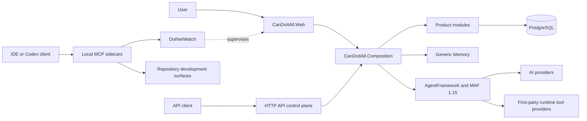

# CanDoItAll

[](https://dotnet.microsoft.com/download/dotnet/10.0)
[](LICENSE)

CanDoItAll is a local-first .NET 10 Blazor Web App for project delivery, durable process execution, workforce coordination, and governed AI-agent automation.

The repository is under active development. It does not currently publish a public NuGet package or provide a supported public release pipeline.

## Ownership

This repository owns:

- the Blazor host, runtime composition, product modules, and HTTP API control plane
- durable project, workflow, process, CRM/HR, plugin, and automation behavior
- the provider-neutral Memory subsystem and its AgentFramework integration
- Microsoft Agent Framework (MAF) adapters, tools, workflow execution, and application templates
- repository-local install, development, validation, and Tailwind entry points

This repository does not own:

- MCP server source, which lives in [CanDoItAll.Mcp](https://github.com/fyziktom/CanDoItAll.Mcp)
- shared UI packages, which live in [CanDoItAll.Components](https://github.com/fyziktom/CanDoItAll.Components)
- canonical standards and Codex skills, which live in [CanDoItAll.SharedInfo](https://github.com/fyziktom/CanDoItAll.SharedInfo)
- the optional native [Cognitive Memory](https://github.com/fyziktom/CanDoItAll.CognitiveMemory), RAG, and Semantic Completion implementations, which live in their respective sibling repositories

Native Cognitive Memory source and tests are owned entirely by its standalone repository. This repository keeps provider-neutral Memory contracts and orchestration, plus the isolated external-service driver under `src/Memory/Drivers/CanDoItAll.Memory.Drivers.CognitiveMemory`. It also retains the migration-only legacy PostgreSQL export bridge and a retirement HTTP shim: `GET /api/cognitive-memory/contract` reports the retired contract and other Cognitive Memory routes return `410 Gone`.

## Runtime Shape



`CanDoItAll.slnx` is the primary solution.

The runtime registers first-party tool providers for Memory, Project Structure, image generation, workflows, Prompt Gallery, prompt curation, workflow curation, capability curation, HR, and Scheduler. A provider still applies its own purpose and authorization policy before attaching tools.

## Requirements

- .NET SDK `10.0.200` feature band or a later patch allowed by `global.json`
- PostgreSQL for the application runtime
- Docker Desktop or another Compose-compatible runtime when using the repository PostgreSQL service
- Windows PowerShell for the local installer and MCP setup scripts
- Node.js and npm only when rebuilding application Tailwind output

The filtered full-solution test gate restores the RAG and Semantic Completion driver packages from NuGet.org. The MCP reinstall workflow needs sibling `CanDoItAll.Mcp` and `CanDoItAll.CodeAnalysis` repositories; it also needs `CanDoItAll.SharedInfo` unless skill synchronization is explicitly skipped.

## Quick Start

Run these commands from the repository root:

```powershell
docker compose up -d postgres
dotnet restore .\src\App\CanDoItAll.Web\CanDoItAll.Web.csproj
dotnet run --project .\src\App\CanDoItAll.Web\CanDoItAll.Web.csproj
```

The default development profile uses:

```text
Host=127.0.0.1;Port=5432;Database=candoitall_development;Username=candoitall;Password=candoitall;Include Error Detail=true
```

Open `http://localhost:5032`. Runtime diagnostics are available at:

- `http://localhost:5032/_dev/runtime`
- `http://localhost:5032/_dev/database/selection`

For a native PostgreSQL installation, prepare the development role and database with:

```powershell
powershell -NoProfile -ExecutionPolicy Bypass -File .\tools\dev\Ensure-DevelopmentPostgres.ps1
```

Important defaults:

- PostgreSQL is the only supported application database. The InMemory driver is test-only, and SQLite is retired.
- The checked-in Compose file publishes database ports without a loopback-only binding. Use it only on a trusted development host, and restrict the binding before joining an untrusted network.
- All generic Memory providers and Memory background workers are disabled until explicitly configured.
- Qdrant is not configured or required by the base host. The Compose service remains available only for optional external or legacy integration work.
- API authorization is disabled by the local default configuration. Do not expose that configuration to an untrusted network.
- Development workspace and control-plane data live under `%LOCALAPPDATA%\CanDoItAll`.

See [Development runtime](docs/development-runtime.md) for configuration and troubleshooting.

## Build And Test

The canonical Release gate, extended test categories, and sibling-repository prerequisites are documented in [Testing](docs/testing.md).

```powershell
dotnet restore .\CanDoItAll.slnx
dotnet build .\CanDoItAll.slnx --configuration Release --no-restore /m:1
dotnet test .\CanDoItAll.slnx --configuration Release --no-build --filter "Category!=Playwright&Category!=LiveProcess&Category!=LongRunning&Category!=Quarantined" /m:1
```

Validate maintained documentation with:

```powershell
& .\tools\Validation\Test-Documentation.ps1
```

## Main Project Families

| Area | Responsibility |
|---|---|
| `src/App` | Blazor host and runtime composition |
| `src/Foundation` | infrastructure, shared primitives, PostgreSQL migrations, and Git integration |
| `src/Integration` | file-tool and external integration adapters |
| `src/Modules` | product-facing module boundaries |
| `src/Processes` | process contracts, drivers, persistence, projections, and runtime |
| `src/Memory` | provider-neutral Memory contracts, orchestration, persistence, and drivers |
| `src/MAF` | AgentFramework core, MAF adapters, providers, tools, workflows, and executors |
| `src/UI` | application-owned UI facade and Git-specific UI integration |
| `src/plugins` | plugin contracts and bundled implementations |
| `tests` | unit, integration, component, Memory, MAF, Playwright, and support tests |
| `tools` | local manager, diagnostics, seeding, installation, and validation |

Project and package dependencies are authoritative in each `.csproj`; project READMEs describe purpose and local validation without duplicating that dependency graph.

## API, Memory, And Agent Runtime

The host exposes typed API groups for projects, project structure, agents, agent recruiting, Prompt Gallery, workflows, processes and run records, plugins, and CRM/HR. OpenAPI is enabled by default for local development. Start with [API control plane](docs/api-control-plane.md).

The active Memory subsystem is the generic provider model under `src/Memory`, composed through `CanDoItAll.Modules.Memory` and `CanDoItAll.AgentFramework.Memory`. Provider setup is explicit and disabled by default. Native Cognitive Memory connects only through the isolated external-service driver. See [Memory](docs/cognitive-memory/README.md) for the current boundary and migration guidance.

MAF package versions are centralized in `src/MAF/MicrosoftAgentFramework.Packages.props`: stable packages use `1.15.0`, and preview-only packages use `1.15.0-preview.260722.1`. See [MAF 1.15 compatibility](docs/maf-1.15-compatibility.md).

## Local MCP And Codex Setup

Install or refresh MCP sidecars from the sibling source repository:

```powershell
powershell -NoProfile -ExecutionPolicy Bypass -File .\tools\Reinstall-CanDoItAllMcps.ps1 -McpRepoRoot ..\CanDoItAll.Mcp
```

Place `CanDoItAll.CodeAnalysis` beside `CanDoItAll.Mcp`. By default the script also resolves `CanDoItAll.SharedInfo` beside this repository; pass `-SharedInfoRepoRoot` when it lives elsewhere, or `-SkipSkillSync` when intentionally omitting skill synchronization.

The active set is CodeAnalytics, Components, DotNetWatch, Mermaid, and SshOps. Processes and Project Structure are HTTP API surfaces, not active MCP servers. There is no LocalRuntime MCP sidecar.

Install the canonical Codex skills from the sibling SharedInfo repository:

```powershell
powershell -NoProfile -ExecutionPolicy Bypass -File .\codex\scripts\install-candoitall-skills.ps1 -SharedInfoRepoRoot ..\CanDoItAll.SharedInfo
```

The checked-in `codex/skills` tree is a historical mirror, not the source of truth. See [Codex skills](codex/README.md).

## Styling

Application-specific Tailwind styles are built here; shared component styles arrive through `CanDoItAll.Components.*` packages.

```powershell
npm install --prefix .\Tailwind
npm run tailwind:build
```

The output is `src/App/CanDoItAll.Web/wwwroot/css/output.css`. See [Tailwind](Tailwind/README.md).

## Packaging

Published CanDoItAll dependencies restore from NuGet.org. Reusable component previews and their tests are owned by the sibling `CanDoItAll.Components` repository, so this repository no longer carries a local component package source. The root `package.json` is private and exists only to provide repository-level Tailwind commands.

The Windows-local web installer is:

```powershell
powershell -NoProfile -ExecutionPolicy Bypass -File .\tools\Install-CanDoItAllWebApp.ps1
```

## Documentation

- [Documentation index](docs/README.md)
- [Architecture](docs/architecture-beta.md)
- [Development runtime](docs/development-runtime.md)
- [Testing](docs/testing.md)
- [Contributing](CONTRIBUTING.md)
- [Security](SECURITY.md)

## License And Contributions

This repository uses the [MIT-Derived License with CanDoItAll Website Link Requirement](LICENSE). Redistributions of the software or a substantial portion of it in source or binary form must include at least one link to [aicandoitall.com](https://aicandoitall.com).

Code contributions are limited to partners approved by the maintainer. See [CONTRIBUTING.md](CONTRIBUTING.md) and contact [fyziktom on LinkedIn](https://www.linkedin.com/in/fyziktom/) before opening a pull request.
