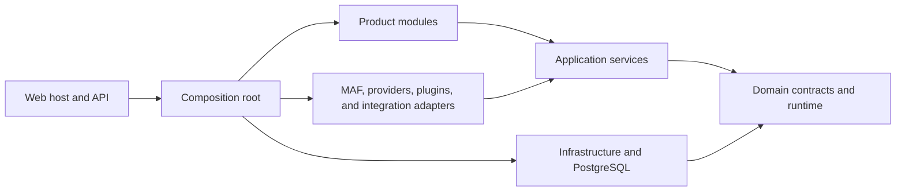

# CanDoItAll

[](https://github.com/fyziktom/CanDoItAll/actions/workflows/ci.yml)
[](https://dotnet.microsoft.com/download/dotnet/10.0)
[](LICENSE)

CanDoItAll is a local-first .NET 10 Blazor application for governed project delivery,
durable process execution, workforce coordination, and AI-agent automation. Product
information is available at [aicandoitall.com](https://aicandoitall.com); this repository
focuses on the implementation and its engineering contracts.

## Ownership

This repository owns:

- the Blazor host, HTTP API, application composition, and product modules
- project, workflow, process, CRM/HR, plugin, Memory, and automation behavior
- provider-neutral AgentFramework contracts and Microsoft Agent Framework adapters
- PostgreSQL persistence, migrations, runtime templates, tests, and repository tooling

This repository does not own:

- development MCP servers from [CanDoItAll.Mcp](https://github.com/fyziktom/CanDoItAll.Mcp)
- shared Blazor components from [CanDoItAll.Components](https://github.com/fyziktom/CanDoItAll.Components)
- family standards and reusable Codex assets from [CanDoItAll.SharedInfo](https://github.com/fyziktom/CanDoItAll.SharedInfo)
- native Cognitive Memory from [CanDoItAll.CognitiveMemory](https://github.com/fyziktom/CanDoItAll.CognitiveMemory)

## Entry Points

| Entry point | Responsibility |
|---|---|
| [`CanDoItAll.Web`](src/App/CanDoItAll.Web/README.md) | Blazor host, HTTP API, OpenAPI, and runtime endpoints |
| [`CanDoItAll.Composition`](src/App/CanDoItAll.Composition/README.md) | Dependency injection and application runtime composition |
| [`src/Modules`](src/Modules/README.md) | Product-facing bounded modules |
| [`src/Processes`](src/Processes/README.md) | Durable process model, execution, projections, and persistence |
| [`src/Memory`](src/Memory/README.md) | Provider-neutral Memory contracts, drivers, and persistence |
| [`src/MAF`](src/MAF/README.md) | AgentFramework and Microsoft Agent Framework integration |
| [`Templates`](Templates/README.md) | Repository-owned runtime seed and template packs |

`CanDoItAll.slnx` is the canonical solution.

## Requirements

- the .NET SDK selected by [`global.json`](global.json)
- PostgreSQL 16 or a compatible supported server
- Docker Desktop or another Compose v2 runtime when using the included database service
- Node.js and npm when rebuilding application Tailwind output
- PowerShell 7 for repository automation

## Quick Start

Run from the repository root:

```powershell
Copy-Item .env.example .env
docker compose up -d --wait db
dotnet restore .\CanDoItAll.slnx
dotnet run --project .\src\App\CanDoItAll.Web\CanDoItAll.Web.csproj
```

Open `http://localhost:5032`. The checked-in database credential is a loopback-only local
development default; replace it before using a shared host.

## Build And Test

```powershell
dotnet restore .\CanDoItAll.slnx
dotnet build .\CanDoItAll.slnx --configuration Release --no-restore /m:1
dotnet test .\CanDoItAll.slnx --configuration Release --no-build --filter "Category!=Playwright&Category!=LiveProcess&Category!=LongRunning&Category!=Quarantined" /m:1
& .\tools\Validation\Test-Documentation.ps1
```

The filtered command is the routine repository gate. Environment-dependent and extended
test lanes are documented in [Testing](docs/testing.md).

## Containers

The base Compose model owns the local PostgreSQL dependency only. It publishes PostgreSQL
on loopback, stores authoritative data in a named volume, and preserves that volume on
normal shutdown.

```powershell
docker compose --env-file .env.example config --quiet
docker compose up -d --wait db
docker compose down
```

See [container operations](docs/operations/containers.md) and
[backup and restore](docs/operations/backup-and-restore.md).

## Architecture

The main dependency direction is:



Start with:

- [Architecture overview](docs/architecture/overview.md)
- [Internal communication](docs/architecture/internal-communication.md)
- [Module map](docs/architecture/modules.md)
- [Documentation index](docs/README.md)

## Styling

Application-specific Tailwind assets live under [`Tailwind`](Tailwind/README.md).

```powershell
npm install --prefix .\Tailwind
npm run tailwind:build
```

Shared component structure and styling belong to `CanDoItAll.Components`.

## Packaging

NuGet packaging and publishing are disabled for this repository. `Directory.Build.props`
sets `IsPackable` to `false` for every project. Package metadata and release tooling will
be introduced only with an explicit package contract and validation gate.

The root npm package is private and exists only to run Tailwind commands.

## License And Contributions

This repository uses the
[MIT-Derived License with CanDoItAll Website Link Requirement](LICENSE). Redistributions
of the software or a substantial portion of it in source or binary form must include at
least one link to [aicandoitall.com](https://aicandoitall.com).

Code contributions are limited to partners approved by the maintainer. See
[CONTRIBUTING.md](CONTRIBUTING.md) and contact the `fyziktom` account on LinkedIn before
opening a pull request.
