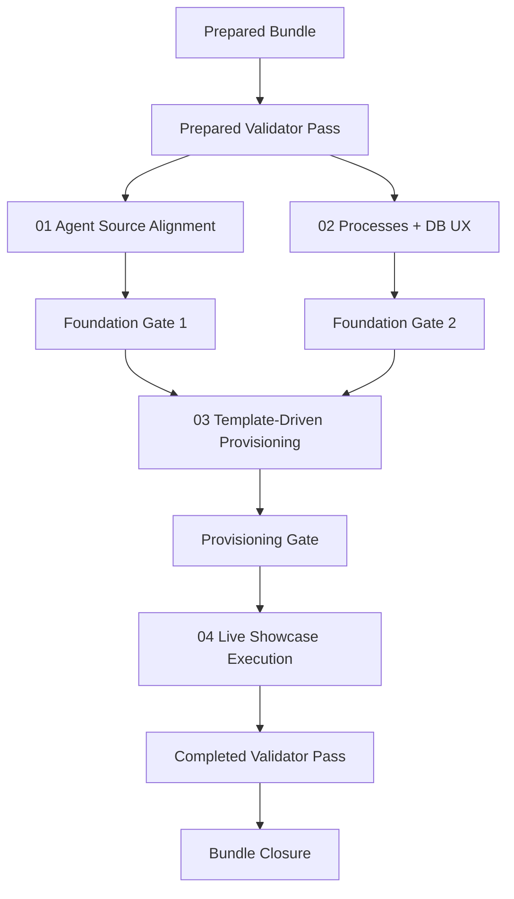

# Phase Plan

## Execution Order

1. Prepare and validate the bundle.
2. Complete subbundle `01-cross-module-agent-source-alignment` as the first critical foundation.
3. Complete subbundle `02-processes-workspace-and-database-profile-ux-fixes` as the second critical UI foundation.
4. Complete subbundle `03-template-driven-showcase-provisioning-and-agent-capability-wiring` only after both foundations hold.
5. Run subbundle `04-live-showcase-execution-bug-harvest-and-closure`, fixing newly discovered blockers until the showcase passes.
6. Re-run bundle validation, review raw-note closure, and close only if every subbundle gate is green.

## Subbundle Dependency Map

## Critical Subbundles

- `01-cross-module-agent-source-alignment` is critical because the showcase depends on CRM-HR sourcing the same agent inventory that process runtime and the dedicated Agents module rely on.
- `02-processes-workspace-and-database-profile-ux-fixes` is critical because the showcase run requires stable process interaction and visible or copyable database paths during manual and browser validation.
- `03-template-driven-showcase-provisioning-and-agent-capability-wiring` is critical because it decides whether the end-to-end run is aligned with the template system or drifts into hardcoded one-off setup.

## Phase Gates

- Gate after preparation: run `validate_bundle.py --profile initiative --stage prepared` and repair every reported gap.
- Gate before each subbundle: confirm the listed prerequisites and source references are still valid.
- Gate after subbundle 01: prove CRM-HR and dedicated Agents routes converge on the same technical-agent inventory and keep edit flows working.
- Gate after subbundle 02: prove process workspace scrolling and database-path copy actions in browser-visible UI.
- Gate after subbundle 03: prove template-driven provisioning against the requested profile root, including roles, process definitions, agent resources, and UI-agent capability wiring.
- Gate after subbundle 04: prove the calculator-delivery showcase completes with artifact flow, QA coverage, progress updates, and recorded bug harvest.
- Gate before closure: rerun validators, update execution analytics, and reject closure if any raw note is still only partially proven.
