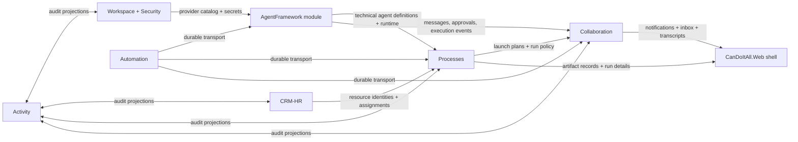
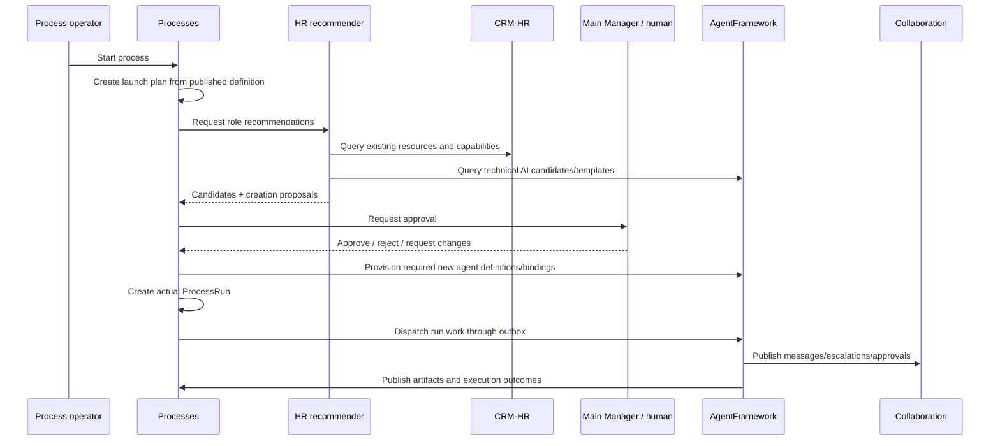

# 01 — Target Solution

## Architectural Goals

- Udělat z AgentFrameworku nativní modul CanDoItAll bez externích compile-time závislostí.
- Zachovat jeden canonical owner pro každý důležitý concern.
- Zavést Collaboration vrstvu dřív než agent-to-agent nebo agent-to-human flows.
- Zabránit procesnímu bypassu: každá komunikace, staffing decision i artifact musí být auditovatelný.
- Zachovat možnost startovat bez AI přes defaultní rule-based HR a Main Manager strategie.
- Vynutit čisté module boundaries a reuse stávajících platform services.

## Target Module Map

| Module | Owns | Does not own |
| --- | --- | --- |
| `CanDoItAll.Modules.Collaboration` | Notification center, conversation threads, unread state, escalation items, process-run transcript projections | Provider data, process role model, technical agent definitions |
| `CanDoItAll.Modules.AgentFramework` | Technical agent definitions, runtime orchestration, tool governance bridge, chat runtime, scenario harness integration | CRM resource identities, provider master data, process role policies |
| `CanDoItAll.Modules.CrmHr` | Resource identities, staffing metadata, project assignments, business AI resource visibility | Technical agent runtime config and execution history |
| `CanDoItAll.Modules.Processes` | Process definition, role messaging policy, launch planning, run orchestration, process artifacts, decision records | Conversation canonical store, provider execution |
| `CanDoItAll.Modules.Workspace` + `Security` | Provider master data, connector metadata, secrets | Canonical AI request execution |
| `Automation` | Durable transport/outbox/retry/dead-letter | User-visible notification inbox or canonical conversations |
| `Activity` | Audit/search projections | Canonical inbox or messaging history |

## Canonical Source-Of-Truth Matrix

| Concern | Canonical owner | Read models / consumers | Hard rule |
| --- | --- | --- | --- |
| Provider profile and secrets | Workspace + Security | AgentFramework integrated provider bridge, Agents/Providers UI | Žádný druhý provider persistence store. |
| Technical agent definition | AgentFramework | CRM-HR agent detail view, Processes staffing recommendations | CRM-HR nesmí zapisovat technical runtime pole přímo do svého business modelu. |
| AI resource identity and availability | CRM-HR | Processes, Projects, AgentFramework views | Agent module nesmí zavést svůj vlastní business resource registry. |
| Process role definition and messaging policy | Processes | Collaboration authorizer, Agent runtime governance bridge | Přímá komunikace mimo policy je zakázaná. |
| Notifications and conversations | Collaboration | MainLayout badge, Activity projections, Processes run detail | Automation je jen transport, ne canonical store. |
| Launch/staffing status | Processes | CRM-HR staffing projections, Collaboration inbox, run detail | `StartRunAsync` nesmí bypassnout launch plan gate. |
| Artifact evidence | Processes + managed storage | Collaboration transcript, Agent runtime detail | Agent workspace artifact není canonical evidence, dokud neprojde bridge. |

## Proposed Physical Project Layout

```text
src/
  CanDoItAll.Modules.Collaboration/
    CollaborationModuleServiceCollectionExtensions.cs
    CollaborationModels.cs
    CollaborationServices.cs
    CollaborationQueries.cs
    Pages/
    Components/
    Integration/
  CanDoItAll.Modules.AgentFramework/
    AgentFrameworkModuleServiceCollectionExtensions.cs
    Domain/
    Runtime/
    Runtime/Maf/
    Persistence/
    Composition/
    Components/
    Pages/
    Integration/
```

## Import Strategy From AgentFramework Repo

1. **Copy, do not reference** source files from the AgentFramework repo into the new module project.
2. Keep imported code grouped by domain/runtime/persistence/components so provenance is still obvious.
3. Replace sandbox host assumptions instead of wrapping them in more layers.
4. Keep namespace root consistent with CanDoItAll modules: `CanDoItAll.Modules.AgentFramework`.
5. Do **not** copy the sandbox shell bootstrap as a second app. Recompose pages into CanDoItAll.Web shell.

## Collaboration Architecture

### Core concepts

- `NotificationInboxItem`
- `ConversationThread`
- `ConversationParticipant`
- `ConversationMessage`
- `EscalationRecord`
- `ContextLink` (`ProjectId`, `ProcessDefinitionId`, `ProcessRunId`, `ProcessStepRunId`, `LaunchPlanId`, `RelatedPartyId`)
- `UnreadState` / acknowledgement
- optional `AttentionStatus` for escalations requiring response

### Responsibility split

- `Collaboration` stores the canonical user-facing thread and inbox state.
- `Automation` carries signals between processes, agent runtime and collaboration projections.
- `Activity` receives summarized audit events.
- `Processes` provides authorization context for process-bound channels.
- `AgentFramework` can create messages only through collaboration/service bridges.

## Process-Governed Messaging Architecture

### Design-time

- Add a new process definition entity such as `ProcessRoleMessagingRule`.
- Add new canvas link type `messaging` between role nodes.
- Rules can be directional or bidirectional; default is **no direct communication**.

### Runtime

- When a launch plan becomes approved and a run starts, `Processes` creates a messaging policy snapshot:
  - allowed role pairs,
  - mapped runtime participants,
  - escalation routes,
  - manager observation rules if required.

### Enforcement rule

Effective permission to send a direct message is:

```text
Agent permission policy
AND Process messaging policy
AND Runtime governance status
```

That means:
- `CanAskOtherAgents = true` is necessary but not sufficient.
- No Messaging link -> no direct conversation.
- Disallowed attempt -> block, record denied event, optionally create escalation.

## Launch / Staffing Architecture

### New lifecycle

```text
Process definition
  -> launch request
  -> launch plan with role snapshots
  -> HR recommendation
  -> manager/human approval
  -> optional resource provisioning
  -> actual process run creation
  -> agent/person execution
```

### Proposed new process-side aggregates

- `ProcessLaunchPlan`
- `ProcessLaunchPlanRole`
- `ProcessLaunchApprovalRecord`
- `ProcessLaunchResourceProposal`
- `ProcessLaunchProvisioningRequest`

### Why not overload `ProcessRun`

`ProcessRun` today represents actual runtime state. Míchat do něj pre-run staffing life-cycle by znamenalo:
- run bez step rows,
- run bez assignments,
- komplikovaný status model,
- obtížně auditovatelné hranice mezi „ještě neodstartováno“ a „už běží“.

Proto bundle doporučuje samostatný launch aggregate.

## CRM-HR ↔ AgentFramework Binding

### Business versus technical split

- `CRM-HR`:
  - party identity,
  - ownership/stewardship,
  - resource availability,
  - business capabilities/tags,
  - review status visible to resource managers.

- `AgentFramework`:
  - executable definition,
  - model/provider binding,
  - tool and permissions policy,
  - runtime options,
  - execution history.

### Explicit binding

Navržená entita / služba:
- `AiResourceBinding`
  - `PartyId`
  - `AgentDefinitionId`
  - `BindingKind`
  - `TemplateKey`
  - `IsPrimary`
  - `LastSynchronizedAtUtc`
  - `TechnicalStatus`
  - `ProvisioningSource`

CRM-HR edit surface má kombinovaný view model, ale writes dělí podle ownershipu.

## Provider Ownership Architecture

### Final decision

- `Workspace.ProviderProfile` + `Security.SecretService` zůstávají canonical master data owners.
- `AgentFramework` se stává canonical runtime ownerem pro:
  - model execution,
  - tool calling,
  - chat/runtime governance,
  - provider diagnostics pipeline.

### Practical effect

- `Workspace/ProviderExecution.cs` přestane být canonical execution path.
- `AgentFramework` dostane `IIntegratedProviderCatalogBridge` a `IAgentProviderCredentialResolver` backed by Workspace/Security.
- Providers UI se přesune nebo rehostuje pod Agents/Providers tabem, ale data zůstanou ve Workspace.

## Workspace Scoping Architecture

### Problem today

- `AddAgentFrameworkCore(workspaceRoot, scope)` registruje globální `FileSandboxWorkspaceStore`.

### Target

- `IAgentWorkspaceLocator`
- `IAgentWorkspaceContextFactory`

Context key minimálně:
- `ProjectId`
- `ProcessRunId`
- `ExecutionRunId`
- optional `LaunchPlanId` / `AgentDefinitionId`

### Storage rule

- Metadata a governance stav: DB / integrated persistent store.
- Working files and transient workspace artifacts: scoped workspace folder.
- Canonical evidence artifacts: managed storage via process artifact bridge.

## Approval And Artifact Bridge

### Approvals

- Agent runtime nevystavuje approvals přímo uživateli.
- Přes `IAgentExecutionGovernanceBridge` se pending approvals promítají do Collaboration inboxu / process approval center.
- Approval decision se vrací idempotentně zpět do agent runtime.

### Artifacts

- Agent runtime vytvoří raw artifact ve scoped workspace.
- Artifact bridge rozhodne, které artifacts se promítnou do managed storage.
- `Processes` zapíše `ProcessArtifactRecord`.
- Collaboration může linkovat na evidence artifact, ale nevlastní ho.

## Component Diagram



## Sequence: Launch And Run



## Architecture Quality Check

Tento návrh řeší všechna explicitní témata ze zadání:
- Collaboration před agent integration: ano.
- Strict process-governed messaging: ano.
- CRM-HR jako main resource pool: ano.
- AgentFramework jako main AI runtime: ano.
- Provider duplicity: ano, přes source-of-truth split.
- HR + Main Manager default fallback: ano.
- UI recomposition do CanDoItAll.Web: ano.
- Scenario and proof discipline: ano.

Nejslabší místo zůstává migrační náročnost. Proto bundle rozděluje práci do více subbundles a zavádí refactor gates místo jednorázové „big bang“ implementace.
