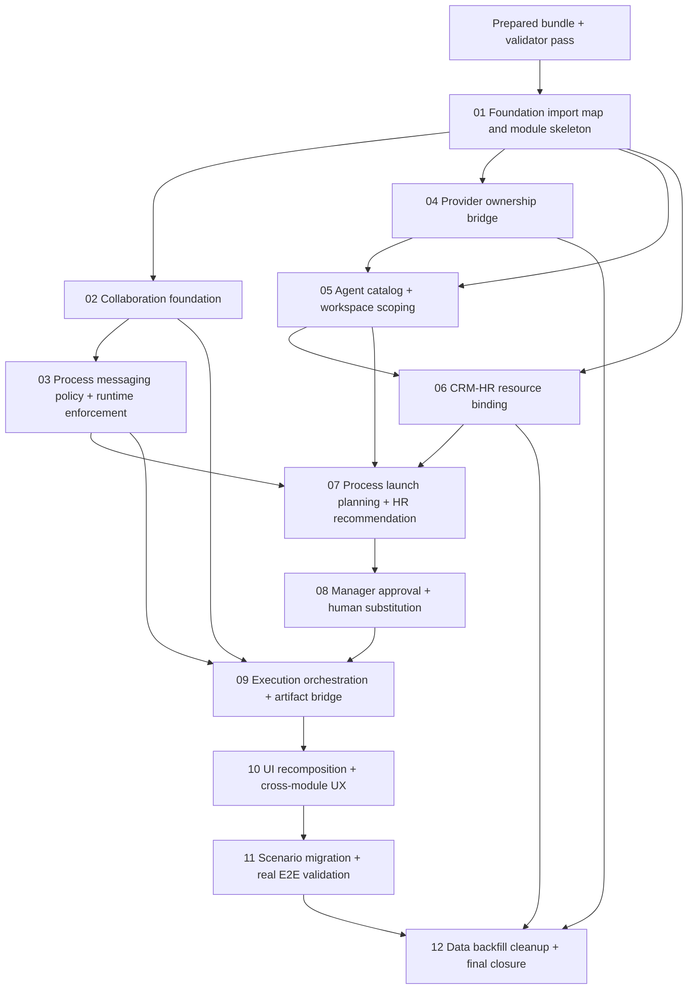

# 01 — Phase Plan

## Phase Sequence

1. **Foundation and boundary enforcement**
   - Establish physical import strategy, new module skeletons, composition hooks and anti-duplication fences.
   - Deliver Collaboration foundation before any agent messaging or human escalation flow.
   - Add process messaging policy model before letting any agent communicate across roles.
2. **Canonical AI and resource ownership**
   - Retire duplicate provider execution path.
   - Introduce integrated AgentFramework persistence/workspace scoping.
   - Bind CRM-HR resource identities to technical agent definitions.
3. **Process launch governance**
   - Add staged launch plan, HR recommendation and manager/human approval.
   - Add provisioning and hand-off into actual process run creation.
4. **Runtime orchestration and user experience**
   - Wire process outbox to agent runtime, artifact bridge and collaboration projections.
   - Recompose Agents UI and deep-link it with CRM-HR and Processes.
5. **Scenario validation, cleanup and closure**
   - Migrate scenario harness, add process-centric scenarios, run story coverage review.
   - Apply data cleanup and final triple-review closure.

## Execution Order

1. `01-foundation-import-map-and-module-skeleton`
2. `02-collaboration-domain-notification-and-conversation-foundation`
3. `03-process-messaging-policy-canvas-and-runtime-enforcement`
4. `04-provider-ownership-bridge-and-legacy-runtime-retirement`
5. `05-agent-catalog-persistence-workspace-scoping-and-governance-bridges`
6. `06-crmhr-resource-binding-and-agent-management-surface`
7. `07-process-launch-planning-hr-recommendation-and-default-strategies`
8. `08-manager-approval-human-substitution-and-resource-provisioning`
9. `09-agent-execution-orchestration-artifact-bridge-and-run-observability`
10. `10-agent-ui-recomposition-shell-tabs-and-cross-module-experience`
11. `11-scenario-migration-real-e2e-validation-and-playwright-proof`
12. `12-data-backfill-cleanup-refactor-gates-and-final-closure`

## Subbundle Dependency Map

## Critical Subbundles

- `01-foundation-import-map-and-module-skeleton`
  - Critical foundation, protože určuje fyzickou podobu merge a source-of-truth fences. Slabý výsledek tady znehodnotí všechno ostatní.
- `02-collaboration-domain-notification-and-conversation-foundation`
  - Critical foundation, protože bez canonical collaboration store není možné korektně uzavřít escalation, approvals ani message transcript proof.
- `03-process-messaging-policy-canvas-and-runtime-enforcement`
  - Critical foundation, protože přímo implementuje nejtvrdší business pravidlo ze zadání: žádná direct communication bez explicitního process linku.
- `04-provider-ownership-bridge-and-legacy-runtime-retirement`
  - Critical foundation, protože brání dvojímu provider runtime.
- `05-agent-catalog-persistence-workspace-scoping-and-governance-bridges`
  - Critical foundation, protože bez ní hrozí sandbox leakage a neintegrovaná approval persistence.
- `07-process-launch-planning-hr-recommendation-and-default-strategies`
  - Critical foundation, protože mění samotný způsob startu procesu a resource selection flow.
- `11-scenario-migration-real-e2e-validation-and-playwright-proof`
  - Critical closure gate, protože odhalí fake integraci nebo process bypass, který by jednotlivé jednotkové testy nemusely zachytit.

## Phase Gates

- **Bundle gate**
  - Validátor bundle musí projít ve stavu `prepared`.
  - Traceability musí pokrývat všechny raw notes.
- **Gate after SB01**
  - Řešení buildí se skeleton moduly.
  - Není dovolena externí project reference na původní AgentFramework repo.
  - Source-of-truth matrix je implementačně reprezentovaná contracts/feature gates.
- **Gate after SB02**
  - Collaboration canonical entities a services existují.
  - Shell umí zobrazit Collaboration entry/badge nebo aspoň foundation route.
  - Automation je používané jen jako transport, ne jako read path pro inbox.
- **Gate after SB03**
  - Canvas umí Messaging link.
  - Runtime authorizer blokuje nepovolenou direct communication.
  - Message transcript pro run má canonical persistence shape.
- **Gate after SB04 + SB05 + SB06**
  - Provider runtime jde přes AgentFramework bridge.
  - CRM-HR a AgentFramework mají explicitní binding.
  - Workspace scope už není globální sandbox root.
- **Gate after SB07 + SB08**
  - Start procesu používá launch plan, recommendations a approval flow.
  - Default HR/Main Manager fungují bez AI provideru.
- **Gate after SB09 + SB10**
  - Run orchestrace, artifacts, notifications a UI deep links fungují přes nové moduly.
- **Gate before final closure**
  - Scenario harness běží v integrated hostu.
  - Story coverage review neobsahuje neřešenou UI mezeru.
  - Cleanup/backfill proof je zaznamenaný.
  - Triple review nemá otevřený blocker.

## Mandatory Stop Conditions

- Objeví se druhá canonical persistence cesta pro provider, agent, conversation nebo process assignment.
- Subbundle failne browser proof na critical UI surface.
- Scenario run se podaří jen přes seednutý shortcut místo standardního flow.
- Executor zjistí, že musí nejprve rozdělit nadměrně velký service/page soubor; v tom případě vytvoří refactor subbundle a update-ne dependency map dřív, než bude pokračovat.

## Validation Program

- Unit tests pro nové policies, mappers, scoring a guards.
- Component tests pro tabs, canvas link editing, detail surfaces a badges.
- Integration tests pro launch plan lifecycle, bindings, provider bridge, approvals, artifacts a outbox orchestration.
- Playwright MCP s desktop screenshoty a užším viewportem pro všechny UI-affecting subbundles.
- Story coverage review proti workbooku.
- Scenario runs `SC01–SC11` podle inventory a final closure report.
