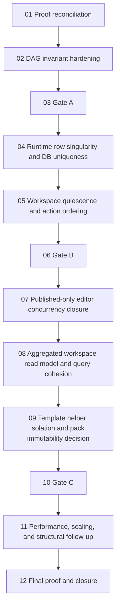

# Phase plan

## Execution Order
1. `01-live-proof-reconciliation-and-unverified-closure-reset`
2. `02-process-graph-dag-invariant-hardening`
3. `03-architecture-review-gate-a`
4. `04-runtime-row-singularity-and-db-uniqueness-hardening`
5. `05-workspace-pending-persistence-quiescence-and-action-ordering`
6. `06-architecture-review-gate-b`
7. `07-published-only-editor-concurrency-closure`
8. `08-aggregated-workspace-read-model-and-query-cohesion`
9. `09-template-helper-isolation-and-pack-immutability-decision`
10. `10-architecture-review-gate-c`
11. `11-performance-scaling-and-structural-follow-up`
12. `12-final-proof-and-closure`

## Subbundle Dependency Map

## Critical Subbundles
- `01-live-proof-reconciliation-and-unverified-closure-reset`
- `02-process-graph-dag-invariant-hardening`
- `04-runtime-row-singularity-and-db-uniqueness-hardening`
- `05-workspace-pending-persistence-quiescence-and-action-ordering`
- `07-published-only-editor-concurrency-closure`
- `12-final-proof-and-closure`

## Phase Gates
- Gate A closes subbundles `01-02` and must be recorded as `Passed` before subbundle `04` may start.
- Gate B closes subbundles `04-05` and must be recorded as `Passed` before subbundle `07` may start.
- Gate C closes subbundles `07-09` and must be recorded as `Passed` before subbundle `11` may start.
- No downstream work may start until the prior gate is recorded in `reviews/01-execution-report.md` and `reviews/02-architecture-gate-memo-log.md`.
