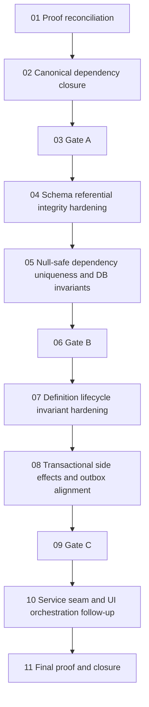

# Phase plan

## Execution Order
1. `01-live-proof-reconciliation-and-gap-reopen`
2. `02-true-canonical-dependency-model-closure`
3. `03-architecture-review-gate-a`
4. `04-process-schema-referential-integrity-hardening`
5. `05-null-safe-dependency-uniqueness-and-db-invariants`
6. `06-architecture-review-gate-b`
7. `07-definition-lifecycle-invariant-hardening`
8. `08-transactional-side-effects-and-outbox-alignment`
9. `09-architecture-review-gate-c`
10. `10-service-seam-and-ui-orchestration-follow-up`
11. `11-final-proof-and-closure`

## Subbundle Dependency Map

## Critical Subbundles
- `01-live-proof-reconciliation-and-gap-reopen`
- `02-true-canonical-dependency-model-closure`
- `04-process-schema-referential-integrity-hardening`
- `05-null-safe-dependency-uniqueness-and-db-invariants`
- `07-definition-lifecycle-invariant-hardening`
- `08-transactional-side-effects-and-outbox-alignment`

## Phase Gates
- Gate A closes subbundles `01-02` and must be recorded as `Passed` before subbundle `04` may start.
- Gate B closes subbundles `04-05` and must be recorded as `Passed` before subbundle `07` may start.
- Gate C closes subbundles `07-08` and must be recorded as `Passed` before subbundle `10` may start.
- No downstream work may start until the prior gate is recorded as `Passed` in `reviews/01-execution-report.md` and `reviews/02-architecture-gate-memo-log.md`.
