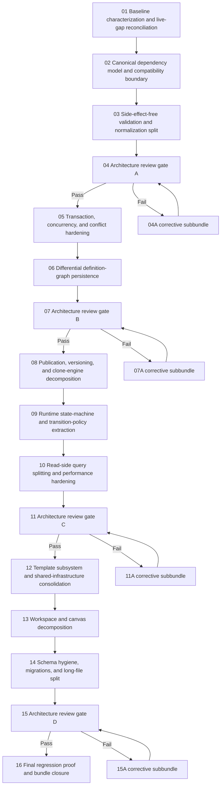

# Phase plan

## Execution Order

1. `01-baseline-characterization-and-live-gap-reconciliation`
2. `02-canonical-dependency-model-and-compatibility-boundary`
3. `03-side-effect-free-validation-and-editor-normalization-split`
4. `04-architecture-review-gate-a`
5. `05-transaction-concurrency-and-conflict-hardening`
6. `06-differential-definition-graph-persistence`
7. `07-architecture-review-gate-b`
8. `08-publication-versioning-and-clone-engine-decomposition`
9. `09-runtime-state-machine-and-transition-policy-extraction`
10. `10-read-side-query-splitting-and-performance-hardening`
11. `11-architecture-review-gate-c`
12. `12-template-subsystem-and-cross-module-shared-infrastructure-consolidation`
13. `13-workspace-and-canvas-decomposition`
14. `14-schema-hygiene-migrations-and-long-file-split`
15. `15-architecture-review-gate-d`
16. `16-final-regression-proof-and-bundle-closure`

## Subbundle Dependency Map

## Critical Subbundles

- `01-baseline-characterization-and-live-gap-reconciliation`
- `02-canonical-dependency-model-and-compatibility-boundary`
- `03-side-effect-free-validation-and-editor-normalization-split`
- `05-transaction-concurrency-and-conflict-hardening`
- `06-differential-definition-graph-persistence`
- `08-publication-versioning-and-clone-engine-decomposition`
- `09-runtime-state-machine-and-transition-policy-extraction`

If any of these are wrong, later proof becomes weak or misleading.

## Phase Gates

- Gate A closes subbundles `01-03` and must be recorded as `Passed` before subbundle `05` may start.
- Gate B closes subbundles `05-06` and must be recorded as `Passed` before subbundle `08` may start.
- Gate C closes subbundles `08-10` and must be recorded as `Passed` before subbundle `12` may start.
- Gate D closes subbundles `12-14` and must be recorded as `Passed` before subbundle `16` may start.
- No downstream work may start until the prior gate is recorded as `Passed` in:
- `reviews/01-execution-report.md`
- `reviews/02-architecture-gate-memo-log.md`

## Corrective insertion rule

Corrective subbundles are not optional detours. They are first-class execution phases whenever a gate fails.
