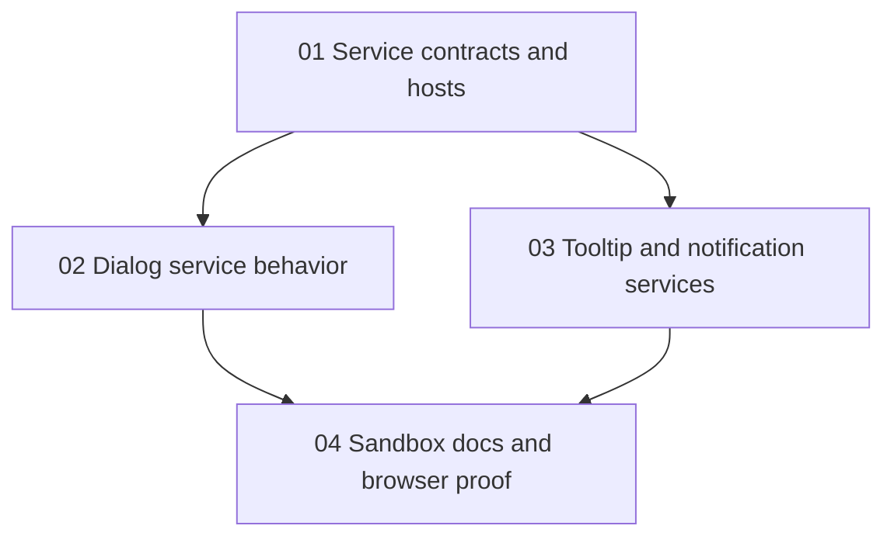

# Phase Plan

## Execution Order

1. Build the shared service contracts, host subscription pattern, DI registration, and backwards-compatible primitives.
2. Implement and test dialog service behavior, result completion, component/fragment rendering, and size handling.
3. Implement and test tooltip service behavior and upgraded notification lifecycle.
4. Add sandbox examples, docs, Tailwind output, and Playwright MCP validation evidence.

## Subbundle Dependency Map

## Critical Subbundles

- `01-01-service-contracts-and-hosts` is a critical foundation because every service-driven overlay depends on DI registration, host mounting, and safe subscription/unsubscription.
- `02-02-dialog-service-behavior` is critical because the request specifically calls out dialog sizing, closing, and returned objects.
- `03-03-tooltip-notification-services` is critical for overlay layering and host consistency, but can proceed after the foundation independently of dialog internals.
- `04-04-sandbox-docs-and-browser-proof` is critical for closure because UI work cannot be accepted without Playwright MCP open-state proof.

## Phase Gates

- Gate 01: BaseLib builds, services are registered, host components render without breaking existing direct `Dialog` and `Notification` usage, and focused host subscription tests pass.
- Gate 02: Dialog service tests prove task-returned objects, close button/backdrop/topmost behavior, component rendering, fragment rendering, and modal size class mapping.
- Gate 03: Tooltip and notification tests prove lifecycle, close/dismiss/clear callbacks, payload handling, duration behavior, and host layering above dialog chrome.
- Gate 04: Sandbox route builds and Playwright MCP proves visible dialogs in multiple sizes, returned object text after close, tooltip open state, notification show/dismiss, and no clipping or z-order failures at desktop and mobile widths.
