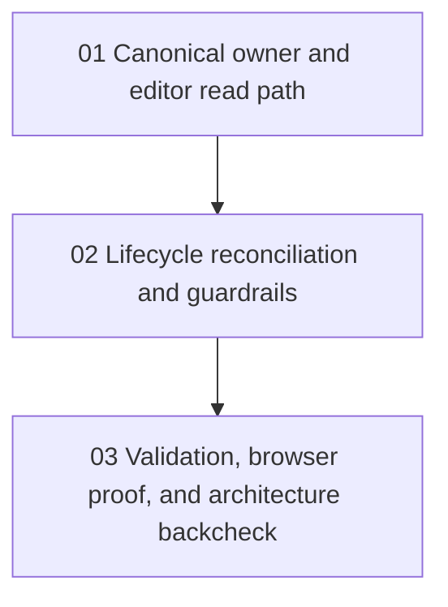

# Phase Plan

## Execution Order

1. `01` - Canonical node assignment owner and editor read path
2. `02` - Node lifecycle reconciliation and canonical guardrails
3. `03` - Validation, browser proof, and post-fix architecture backcheck

## Subbundle Dependency Map

## Critical Subbundles

- `01` is the critical foundation because it establishes the single canonical owner and the read path used by the structure-page editor.
- `02` is the critical lifecycle foundation because stale assignments on delete or transfer would invalidate the canonical-owner repair.
- `03` is the closure phase because browser proof and architecture backcheck decide whether the repair is safe to build on.

## Phase Gates

- Prepared gate: run `scripts/validate_bundle.py --stage prepared` and repair any contract drift before production edits.
- Entry gate before each subbundle: confirm source references and prerequisite proof still match the live repo.
- Closure gate after each subbundle: record code proof, update execution report rows, and do not advance on weak evidence.
- Final closure gate: run `scripts/validate_bundle.py --stage completed`, complete browser analytics, and record the post-fix architecture review.
