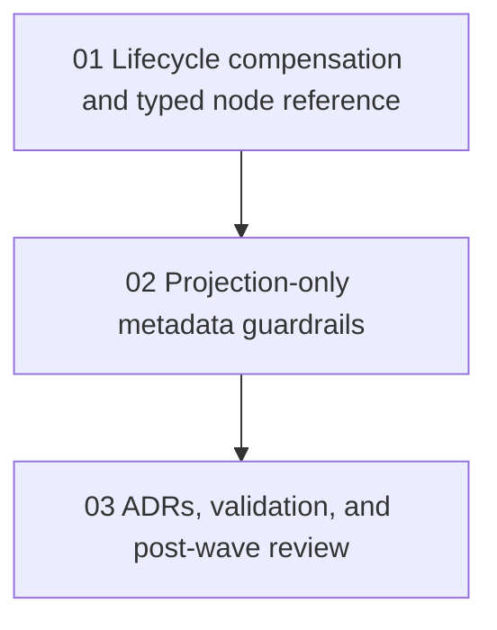

# Phase Plan

## Execution Order

1. `01` - Workbench lifecycle compensation and typed node reference
2. `02` - Projection-only party metadata and display guardrails
3. `03` - ADR guardrails, validation, and post-wave review

## Subbundle Dependency Map

## Critical Subbundles

- `01` is the critical foundation because it hardens the live cross-module mutation seam.
- `02` is the critical projection discipline phase because future features will copy whatever metadata pattern remains.
- `03` is the closure phase because architecture guardrails and proof decide whether this wave actually reduced future risk.

## Phase Gates

- Prepared gate: `python scripts/validate_bundle.py <bundle-root> --stage prepared`
- Entry gate before each subbundle: confirm prior prerequisites are complete and still trusted
- Closure gate after each subbundle: update execution evidence before advancing
- Final closure gate: `python scripts/validate_bundle.py <bundle-root> --stage completed` plus the post-wave architecture review
