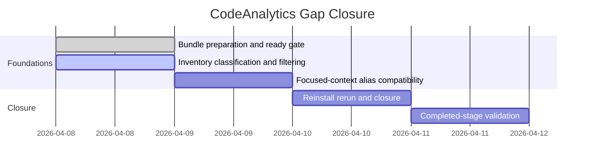

# Phase Plan

## Phase Sequence

1. Prepare the bundle from the two residual findings and pass the prepared-stage validator.
2. Execute subbundle 01 to add first-class inventory classification and a precise primary reverse-reference answer path.
3. Execute subbundle 02 to add the focused-context `Behavior` compatibility alias without regressing current intent handling.
4. Execute subbundle 03 to reinstall the MCP, rerun the affected Zyphonote scenarios plus regression checks, and close raw notes and findings.
5. Run the completed-stage validator and sync the bundle to the shipped state.

## Subbundle Dependency Map

## Critical Subbundles

- `subbundles/01-project-inventory-classification-and-filtering` is the critical foundation.
- Downstream rerun proof is untrustworthy unless subbundle 01 proves both precise product answers and preserved supporting-project visibility.
- `subbundles/02-focused-context-legacy-intent-compatibility` needs targeted proof before closure but does not block subbundle 01.

## Phase Gates

- Gate after preparation: run `validate_bundle.py --stage prepared` and repair every failure before implementation starts.
- Gate before subbundle 01: confirm the prior parity bundle is closed and its finding files remain the source of truth.
- Gate after subbundle 01: require targeted tests proving project classification and product-vs-supporting separation before subbundle 03 can rely on rerun precision.
- Gate after subbundle 02: require deterministic proof that `Behavior` resolves cleanly and `TroublePath` still works.
- Gate before closure: reinstall the MCP, rerun the gap scenarios and regress the prior five-scenario path, then run `validate_bundle.py --stage completed`.
