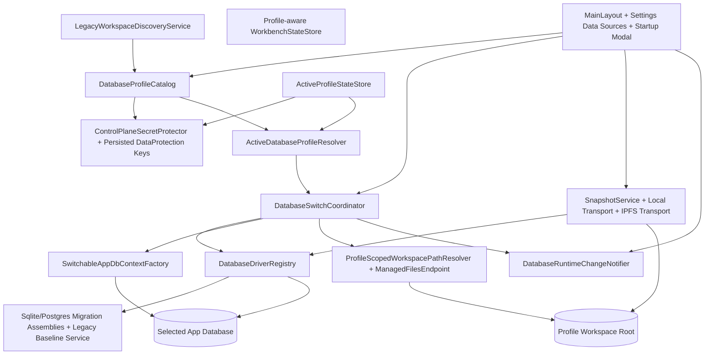

# Target Solution

## Architectural Decisions

- Promote database connectivity from startup configuration to a **control-plane-managed runtime profile**.
- Keep the control plane **outside** the selected app database so profile metadata and credentials are available before opening any app DB.
- Replace normal-path `EnsureCreatedAsync()` + SQLite-only SQL initializers with a migrations-based schema path for both SQLite and PostgreSQL.
- Make workspace storage profile-scoped and make file serving resolve the active profile at request time.
- Use reliable forced reload and profile-aware workbench state to guarantee that active pages/services pick up the new database after a switch.
- Implement clone/snapshot/versioning as a provider-agnostic package flow so SQLite and PostgreSQL can both participate.

## Target Component Model



## Control Plane

### Responsibilities

- Persist the catalog of known database profiles.
- Persist the active/last-used profile and startup-prompt metadata.
- Encrypt control-plane secrets such as PostgreSQL passwords or IPFS auth material.
- Discover legacy/default SQLite databases from the current repo-root/content-root layout.
- Hold managed SQLite workspace roots under a stable app-level root.
- Persist the DataProtection key ring so encrypted control-plane metadata survives restarts.

### Recommended storage layout

Use a root under local app data, with an override option for tests:

```text
%LOCALAPPDATA%/CanDoItAll/
  control-plane/
    dataprotection-keys/
    database-profiles/
      catalog.json
      active-profile.json
      managed-sqlite/
        <profile-id>/
          db/
            candoitall.db
          workspace/
            managed-files/
            exports/
            evidence/
      snapshot-cache/
      snapshots/
```

Recommended abstractions:

- `IDatabaseProfileCatalog`
- `IActiveDatabaseProfileStore`
- `IControlPlaneRootResolver`
- `IControlPlaneSecretProtector`
- `ILegacyWorkspaceDiscoveryService`
- `IDatabaseProfileValidationService`

### Database profile shape

Each profile should capture at least:

- `Id`, `DisplayName`, `ProviderKind`
- `SourceKind` (`ManagedSqlite`, `ExternalSqliteFile`, `ImportedSqlite`, `PostgresConnection`, `SnapshotCache`, `IpfsSnapshot`)
- provider-specific connection/source descriptor
- profile-scoped storage root descriptor
- `IsManaged`, `CreatedUtc`, `LastUsedUtc`, `LastSuccessfulOpenUtc`
- clone/snapshot origin metadata
- `IsLockedByRuntimeOverride` or equivalent
- normalized connection fingerprint used for workbench/browser isolation and diagnostic display

## Runtime Resolution And Switching

### Resolution order

1. Explicit config/env override (`Database:*`) when intentionally supplied for tests/headless mode.
2. Persisted active profile from the control plane.
3. Auto-discovered legacy SQLite profile if the catalog is empty and a legacy workspace exists.
4. Auto-provisioned managed SQLite profile if nothing else exists.

### Runtime switch mechanics

Use a custom factory rather than startup-bound EF registration:

- Replace direct provider binding in `AddDbContextFactory` with a `SwitchableAppDbContextFactory` that resolves the active profile on every `CreateDbContextAsync`.
- Introduce `DatabaseSwitchCoordinator` that:
  - acquires a global switch lock
  - blocks new leases/contexts
  - waits for active contexts or short-running operations to drain
  - validates/initializes the target database
  - persists the new active profile
  - updates the active runtime generation
  - publishes a `DatabaseProfileChanged` notification
- Modify `AppDbContext` so context disposal can release an active switch lease/token. This may require making `AppDbContext` non-sealed or adding a disposable lease dependency.

Recommended abstractions:

- `IActiveDatabaseProfileResolver`
- `IDatabaseSwitchCoordinator`
- `IDatabaseRuntimeState`
- `IDatabaseDriver`
- `IDatabaseDriverRegistry`
- `IDatabaseSwitchNotificationService`
- `IDatabaseRuntimeParticipant` for services/caches that must react explicitly

## Provider Drivers

### SQLite driver

Support these source modes:

- managed SQLite profile created under the control plane
- external file path opened in place
- imported external SQLite file copied into a managed profile
- snapshot/IPFS-derived SQLite source materialized into a local managed working copy

Mandatory driver capabilities:

- normalize/validate SQLite source descriptors
- test file accessibility
- create empty DB file + run migrations
- clone/import from snapshot package
- expose a stable fingerprint for workbench/browser keying

### PostgreSQL driver

Support these source modes:

- localhost or Docker-hosted localhost
- remote PostgreSQL server
- create target DB using an admin connection or admin-db descriptor

Mandatory driver capabilities:

- test connection
- normalize connection metadata without leaking secrets
- create empty target database when permitted
- run migrations against the target DB
- clone/import from snapshot package

## Migrations Strategy

### Required shift

Normal-path startup must stop using `EnsureCreatedAsync()` as the schema strategy.

### Recommended implementation

- Add provider-specific migrations projects, for example:
  - `src/CanDoItAll.Migrations.Sqlite`
  - `src/CanDoItAll.Migrations.Postgres`
- Move `ModuleAssemblies.All` into a neutral composition project or shared location so the web app, tests, and migration projects all use the same model-composition source.
- Use provider-specific design-time factories that call `AppDbContextModelRegistry.ConfigureAssemblies(...)` before creating the context.
- New database creation and normal startup should call migration/bootstrap services, not raw schema initializers.

### Legacy SQLite upgrade path

Because current DBs may have been created by `EnsureCreatedAsync()` + custom SQL:

- detect a legacy DB by table presence and missing `__EFMigrationsHistory`
- reconcile any expected legacy SQLite schema quirks before baseline insert
- insert the baseline migration row only when the schema matches the expected pre-migration state
- then execute remaining migrations normally

The old SQLite initializer classes can remain temporarily as legacy-reconciliation helpers, but they must **not** remain the final normal-path schema authority.

## Storage And Managed Files

### Required shift

- Replace `C:\repositories\CanDoItAll/src/CanDoItAll.Web/Program.cs` fixed `UseStaticFiles(new PhysicalFileProvider(...))` usage with a request-time managed-files endpoint or middleware that resolves the active profile storage root per request.
- Replace singleton global workspace resolution with profile-aware resolution for:
  - managed files
  - exports
  - evidence
- Keep manager artifacts app-scoped unless a later requirement proves they must be profile-scoped.

### Host integrations

Update the consumers that currently assume one workspace root:

- `C:\repositories\CanDoItAll/src/CanDoItAll.Modules.Workbench/ProjectStructureLocalFileOpener.cs`
- `C:\repositories\CanDoItAll/src/CanDoItAll.Modules.Workbench/ProjectStructureRuntimeLauncher.cs`
- `LocalFileStore` / `ManagedArtifactStore`
- any future snapshot import/export path logic

## Runtime Reload And Workbench Safety

### Reliable reload strategy

Do not rely on every page manually refreshing itself after a switch. Use a hard guarantee:

- publish a switch-generation event from the server runtime
- broadcast the generation/profile change through browser storage or `BroadcastChannel`
- have the current and other open browser tabs navigate to a safe route with `forceLoad: true`
- rehydrate page-scoped services from the new active profile on the new circuit

### Workbench isolation

- Make `BrowserWorkspaceStateStore` compute the storage key from the active database profile or fingerprint.
- Extend `WorkbenchSessionSnapshot` with database/profile metadata.
- Reset/clear the scoped workbench session when the active profile changes.
- Add stale-artifact handling so project/calendar/detail routes show a safe not-found/recover UI when the target entity does not exist in the new DB.

## UI Flows

### MainLayout

Add:

- active database badge and short descriptor
- a quick-switch action
- switch-in-progress guard/indicator
- startup continue/switch modal after initial profile resolution
- current-profile override-lock banner or disabled switch control when explicit runtime override is active

### Settings Page

Add a new **Data Sources** tab that can:

- list known database profiles
- show current active profile
- create empty SQLite/PostgreSQL databases
- open/import external SQLite files
- test PostgreSQL connections
- activate a profile
- clone/snapshot a profile
- restore/open a snapshot or IPFS-backed snapshot source

The existing workspace/provider/secrets tabs stay in the selected database; the new database-profile UI lives outside it.

## Snapshot / Clone / Versioning

### Canonical approach

Use a provider-agnostic snapshot package that contains:

- manifest metadata
- per-table data export
- profile-scoped storage files required for the branch/versioning workflow
- optional transport metadata such as IPFS CID

This makes SQLite↔PostgreSQL clone flows possible.

### Transport boundary

Implement:

- `ILocalSnapshotTransport`
- `IIpfsSnapshotTransport` or `ISnapshotTransport` with local and IPFS implementations

The IPFS transport should add/download/pin snapshot packages through an HTTP API client and then materialize them into a local working copy or a clone target.

## Testing And Closure Strategy

- Treat subbundles 02 through 06 as **critical foundations**. Weak proof there invalidates later UI/E2E proof.
- Do not expose the switch UI to end users until runtime switching, storage isolation, and stale-route recovery all have automated proof.
- Require browser screenshots for the startup modal, active DB switcher, settings Data Sources screen, and an artifact route before/after switch.
- Require PostgreSQL and clone proof before final closure. If PostgreSQL or IPFS environments are unavailable, final status must be `Blocked`, not `Completed`.
