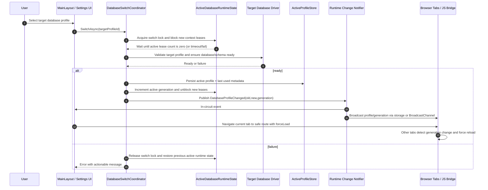

# Runtime Switch Sequence

## Sequence Diagram

## Contract Notes

- The switch coordinator must treat timeout while draining active operations as a **real failure**, not as silent force-switch success.
- The current tab and other open tabs must both respond to the published generation change.
- The safe route should be a page that is always valid under any profile, for example `/` or `/settings?tab=data-sources`.
- Stale artifact pages must still render a not-found/recover state if reached directly after a switch or refresh.
