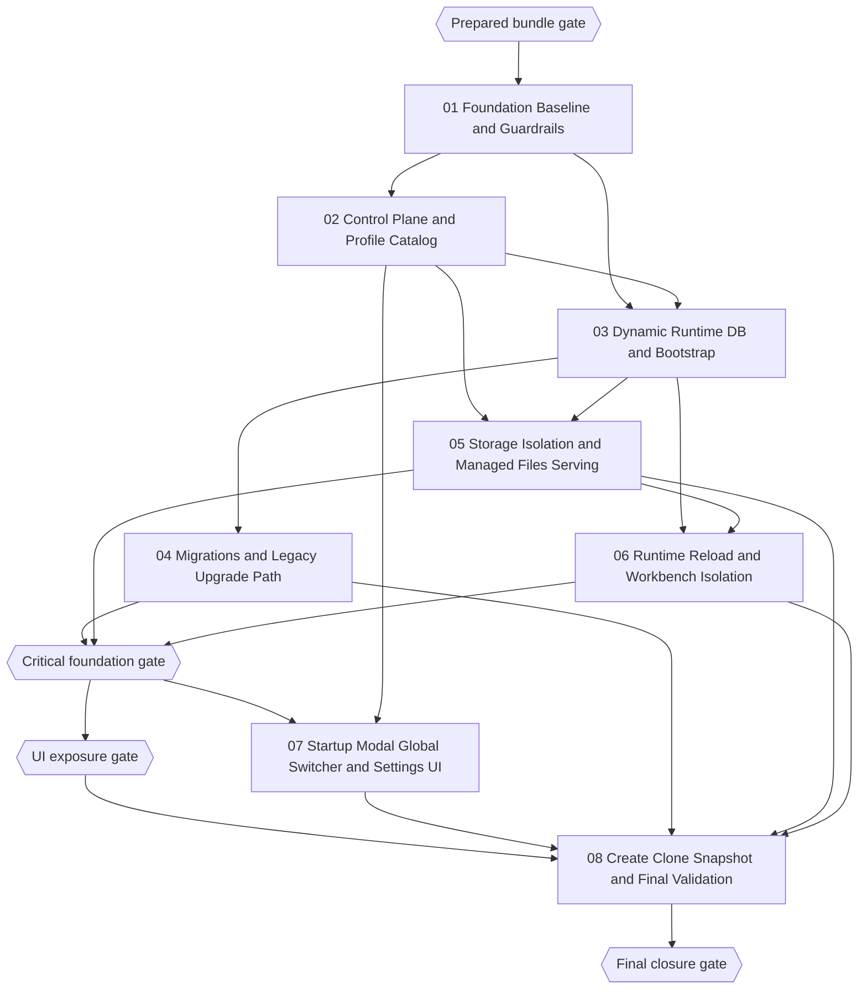

# Phase Plan

## Execution Order

1. **Subbundle 01 — Foundation Baseline and Guardrails**
   - Establish shared test fixtures, proof templates, stop-the-line rules, and the inventory baseline used by every later phase.
2. **Subbundle 02 — Control Plane and Profile Catalog**
   - Introduce app-level database-profile storage, persisted key-ring configuration, profile metadata, and override/legacy-resolution rules.
3. **Subbundle 03 — Dynamic Runtime DB and Bootstrap**
   - Introduce the switchable DbContext factory, provider drivers, runtime resolution, and switch coordination.
4. **Subbundle 04 — Migrations and Legacy Upgrade Path**
   - Replace normal-path `EnsureCreatedAsync()` with migrations, add provider-specific migration support, and baseline legacy SQLite DBs.
5. **Subbundle 05 — Storage Isolation and Managed Files Serving**
   - Make workspace storage profile-scoped and managed-file serving runtime-aware.
6. **Subbundle 06 — Runtime Reload and Workbench Isolation**
   - Make route reload, workbench state, and stale-artifact handling safe across profile switches.
7. **Subbundle 07 — Startup Modal, Global Switcher, and Settings UI**
   - Expose the new functionality to users only after the switching/runtime foundations are proven.
8. **Subbundle 08 — Create, Clone, Snapshot, and Final Validation**
   - Finish empty-create and clone/versioning flows, add local/IPFS snapshot transport, and execute the full proof matrix.

## Subbundle Dependency Map

## Critical Subbundles

- `subbundles/02-control-plane-and-profile-catalog`
  - If the catalog/active-profile model is wrong, every downstream switch, UI, and test path will be built on the wrong source of truth.
- `subbundles/03-dynamic-runtime-db-and-bootstrap`
  - This phase defines whether runtime switching actually exists or whether the UI is still pretending over startup-only config.
- `subbundles/04-migrations-and-legacy-upgrade-path`
  - Weak proof here invalidates all provider-parity, create-database, and clone/snapshot claims.
- `subbundles/05-storage-isolation-and-managed-files-serving`
  - Weak proof here invalidates clone/versioning claims and any browser proof that depends on managed files after switching.
- `subbundles/06-runtime-reload-and-workbench-isolation`
  - Weak proof here invalidates any UI claim about “runtime switching works,” because stale routes and stale browser state are the main failure mode.

## Phase Gates

| Gate | Trigger | Must Be True Before Proceeding | Reopen If |
| --- | --- | --- | --- |
| `Prepared bundle gate` | Before implementation starts | Prepared-stage validator passes; self-review is complete; every raw note is mapped to a subbundle or explicit boundary | Any placeholder or unmapped note remains |
| `Critical foundation gate` | Before UI exposure in subbundle 07 | Subbundles 02–06 have code + tests + proof strong enough that UI work will not paper over missing foundations | Switching, migrations, storage, or stale-route proof is weak or blocked |
| `UI exposure gate` | Before clone/snapshot/browser-heavy closure work | Startup modal and global switcher have a stable backend contract, and no fake switch path remains | UI still talks to temporary/incomplete service contracts |
| `Final closure gate` | Before the bundle is declared complete | Full test matrix and browser analytics are recorded, raw note closure is explicit, and blocked proof is honest | PostgreSQL/IPFS/browser proof is missing, screenshots are not reviewed, or any subbundle is falsely marked complete |

## Execution Notes

- Every subbundle must update `reviews/01-execution-report.md` with commands, browser analytics, and gate results before downstream work continues.
- If a later subbundle reveals a weakness in an earlier critical foundation, execution must reopen the earlier subbundle instead of explaining the weakness away in residual-risk text.
- The final closure gate is not allowed to pass if PostgreSQL runtime proof, runtime-switch browser proof, or clone/storage proof is absent.
