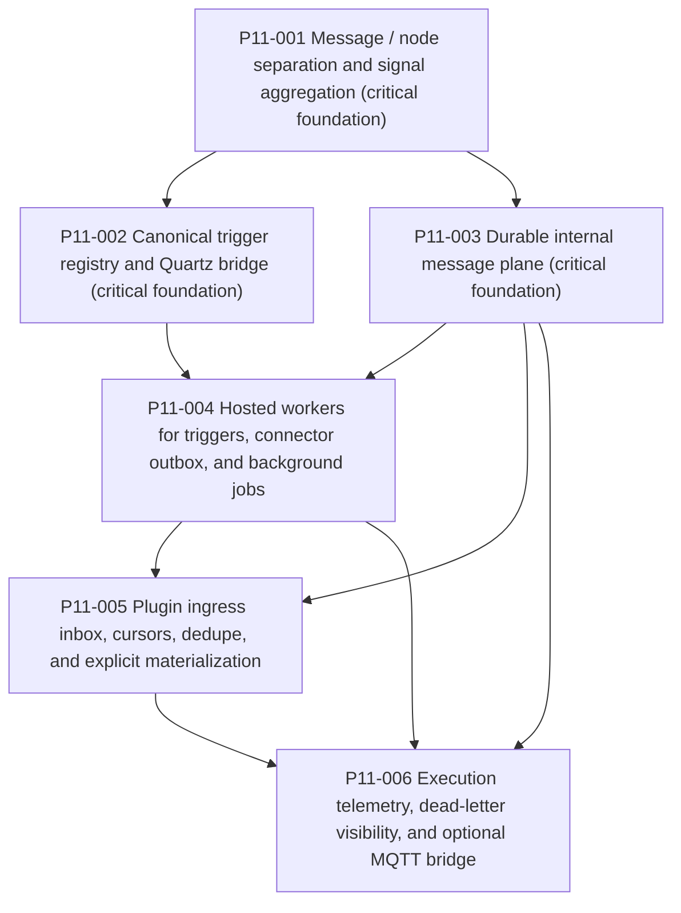

# Phase11 refactor plan

## Objective
Add the execution/runtime substrate required for the next plugin wave without promoting operational envelopes into the canonical Workbench graph.

## Critical foundations
- `p11-001` is a critical foundation because every later runtime concern depends on a clean execution-plane boundary and open-world automation signal aggregation.
- `p11-002` is a critical foundation because due-trigger execution must publish into a canonical runtime plane instead of running inline or inventing per-plugin timers.
- `p11-003` is a critical foundation because hosted workers, ingress, retries, and observability all depend on durable dispatch semantics.

## Dependency map

## Planned workstreams
1. Separate operational messages from domain nodes and replace singular automation signal consumption with an aggregated contributor model.
2. Add canonical trigger definitions and a Quartz scheduler projection that publishes durable runtime work.
3. Add durable internal message envelopes, fan-out subscriptions, retries, dedupe, delayed delivery, and dead-letter support.
4. Add hosted workers that drain due trigger work, connector outbox commands, and durable background jobs automatically.
5. Add plugin ingress inbox, cursors, dedupe, and explicit materialization so external streams stop bypassing the runtime plane.
6. Add execution policy, attempt logs, operator visibility, and an optional MQTT bridge that remains non-canonical.

## Entry gate by subbundle
- `p11-001`: no prerequisites. Confirm the repo still consumes `IAutomationSignalProvider` singularly and that no operational envelopes have been added as Workbench nodes.
- `p11-002`: `p11-001` must be complete and trusted. Confirm trigger ownership stays outside Workbench canonical tables.
- `p11-003`: `p11-001` must be complete and trusted. Confirm message handlers are execution-plane only and do not auto-materialize nodes.
- `p11-004`: `p11-002` and `p11-003` must be complete and trusted. Confirm worker logic drains durable sources instead of reviving in-memory authority.
- `p11-005`: `p11-003` and `p11-004` must be complete and trusted. Confirm ingress envelopes can stay unmaterialized until an explicit materializer runs.
- `p11-006`: `p11-003` must be complete and trusted. Confirm telemetry and MQTT remain adapters around the runtime plane rather than becoming canonical state.

## Progression gates
- After `p11-001`, downstream phases may continue only if automation signals aggregate multiple contributors and operational envelopes remain outside the Workbench node graph.
- After `p11-002`, downstream phases may continue only if canonical trigger definitions round-trip scheduling semantics and Quartz wakeups publish durable runtime work.
- After `p11-003`, downstream phases may continue only if fan-out, retry, delayed delivery, dedupe, and dead-letter behavior are proven with durable storage.
- After `p11-004`, downstream phases may continue only if workers run automatically through host/runtime registration and drain durable work without manual service calls.
- After `p11-005`, downstream phases may continue only if ingress envelopes persist before materialization and cursor/dedupe state survives restart boundaries.
- After `p11-006`, the bundle may close only if execution telemetry, dead-letter visibility, and optional MQTT disabling are all proven and the core runtime still works.

## Expected outcome
Plugins will only need to define:
- trigger definitions
- subscriptions and handlers
- ingress materializers
- domain outputs

They will no longer need to build their own polling loops, retry ledgers, or timing logic.
