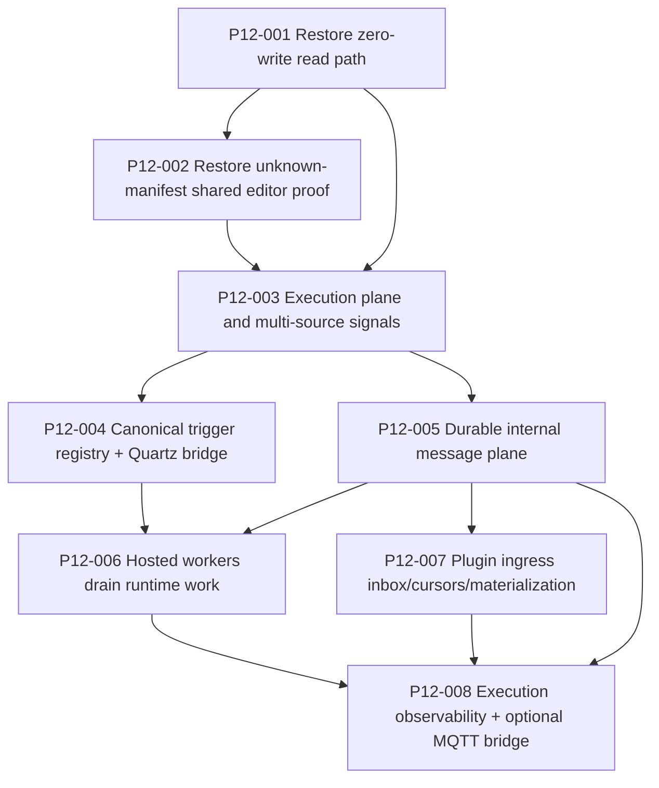

# Phase12 recovery sequence

Phase12 is a recovery-first bundle. The current workspace may already exceed the stale ZIP snapshot described in the bundle reviews, so the execution loop must validate reality before re-implementing anything.

## Dependency map

## Critical foundations
- `P12-001` is a critical foundation because the Workbench read path must stay read-only before any runtime-plane work can be trusted.
- `P12-002` is a critical foundation because the plugin wave depends on manifest-driven configuration editors that remain open-world.
- `P12-003`, `P12-004`, and `P12-005` are critical foundations for downstream hosted-worker, ingress, and observability work.

## Entry gate
- Confirm the current workspace state before re-implementing recovery work from the stale ZIP narrative.
- Validate that phase10, phase11, and phase12 gate mechanisms exist and can be executed on the current repo.
- Reopen the bundle if the bundle prose conflicts with the validated repo state.

## Non-negotiable order
1. **Restore phase10 closure first**
   - zero-write Workbench reads,
   - projection repair boundary,
   - unknown-manifest shared editor proof.

2. **Run the phase10 gate on the current repo until it is green**

3. **Only then implement the runtime-plane work from phase11**
   - execution-plane separation,
   - trigger registry + Quartz,
   - durable message plane,
   - hosted workers,
   - ingress inbox,
   - observability.

4. **Run phase11 gate and phase12 gate on the current repo**

5. **Provide evidence**
   - current gate outputs,
   - required tests present,
   - migrations/snapshots updated for durable runtime records.

## Progression gate
- Do not advance past `P12-002` until the restored phase10 proof is current and trusted on this repo.
- Do not advance into later runtime subbundles unless the validated repo state still shows a real gap.
- If the repo already satisfies a subbundle, capture fresh proof and close the subbundle instead of fabricating code churn.

## Why the order matters
The current uploaded ZIP is below the previous validated baseline.
Continuing phase11 work without first restoring phase10 would make the runtime plane sit on top of a non-deterministic Workbench core.
