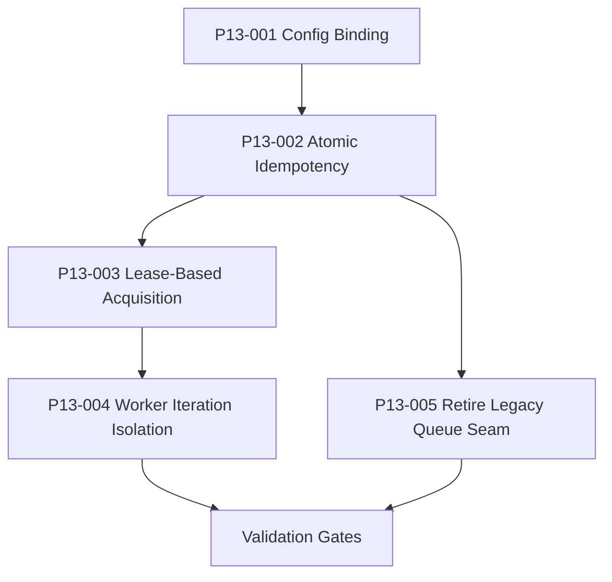

# Phase13 execution plan

Bundle13 is a runtime-hardening bundle and its sequencing is a critical foundation for the incoming plugin wave.

## Entry gate

- Phase10, phase11, and phase12 gates must still pass before phase13 work is accepted.
- The implementation must close every hidden blocker described in the review bundle, not just the ones already covered by older gates.
- The bundle package itself must be executable under the normal workflow, including a prepared-stage validator and a final execution report.

## Progression gate

- Do not treat read-then-insert dedupe as sufficient once concurrency tests are introduced.
- Do not keep broad in-memory scans in hot worker paths once lease-based acquisition is in place.
- Do not close the bundle while production code still schedules new work through the legacy in-memory queue seam.
- Do not close the bundle until targeted tests, the phase13 gate, and the bundle validator all pass against the modified repo.
