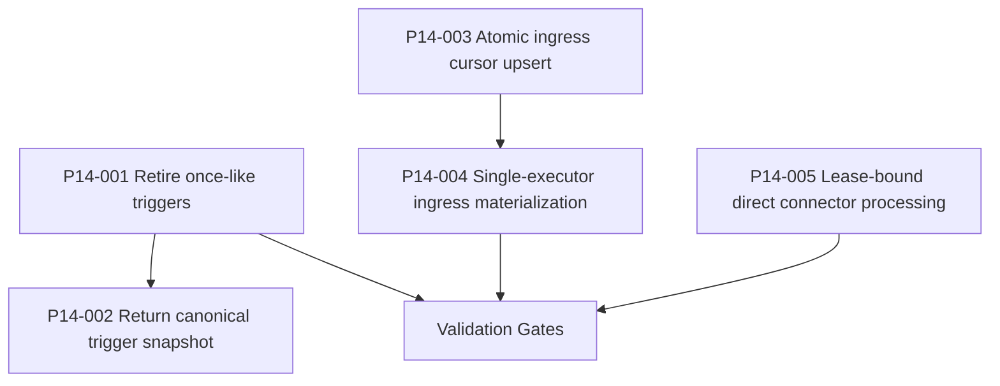

# Phase14 execution plan

Bundle14 is a runtime-semantics bundle. Its critical foundations are restart safety, canonical trigger snapshots, and single-executor durable boundaries.

## Entry gate

- Phase10 and phase13 carry-forward gates must still pass before phase14 work is accepted.
- The bundle package itself must be executable under the standard workflow, including prepared-stage validation, execution tracking, and completed-stage validation.
- The implementation must close all five hidden runtime-semantic defects described in the bundle14 review without weakening the requested operator or restart semantics.

## Critical foundation

- `P14-001` is a critical foundation because restart-safe trigger retirement defines whether once-like automation can be trusted after projection rebuild.
- `P14-004` and `P14-005` are critical foundations because they enforce the single-executor semantic boundary for future plugin side effects.

## Progression gate

- Do not close phase14 while once-like triggers can still be rehydrated after they already fired.
- Do not close phase14 while trigger save returns a stale pre-projection snapshot.
- Do not close phase14 while ingress cursor save or ingress materialization still exposes a read-then-act race.
- Do not close phase14 while direct connector processing still has a non-leased execution path.
- Do not close phase14 until targeted tests, carry-forward gates, the phase14 gate, and the completed bundle validator all pass against the modified repo.
