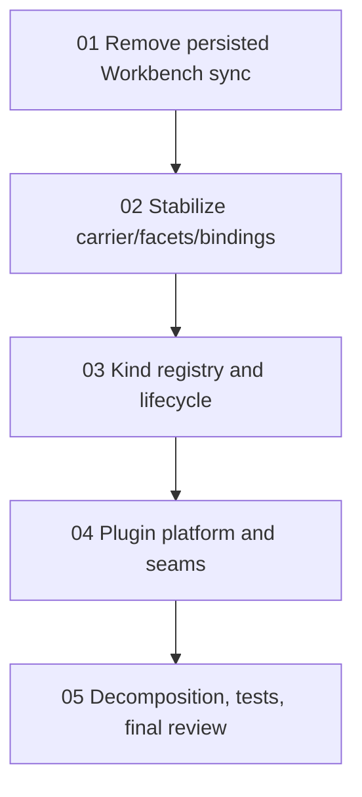

# Phase Plan

## Execution Order

1. `01` - Remove persisted Workbench sync as parallel truth
2. `02` - Stabilize node carrier, facets, and bindings
3. `03` - Centralize node-kind registry and lifecycle history
4. `04` - Introduce plugin platform and harden cross-module seams
5. `05` - Decompose services, add guardrail tests, and rerun review

## Subbundle Dependency Map

## Critical Subbundles

- `01` is the first hard blocker because it removes the remaining parallel truth.
- `02` is the semantic foundation because it keeps node universal while making the carrier stable.
- `03` is the extensibility foundation because it converts node-kind and lifecycle semantics into governed contracts.
- `04` is the direct plugin-wave foundation.
- `05` is the final gate that decides whether the plugin wave may actually begin.

## Phase Gates

- Prepared gate: `python scripts/validate_bundle.py <bundle-root> --stage prepared`
- Entry gate for each subbundle: all prerequisites complete and still trusted
- Closure gate for each subbundle: required proof artifacts collected and reviewed
- Final closure gate: rerun the canonical-model review in the real .NET environment after SB05
