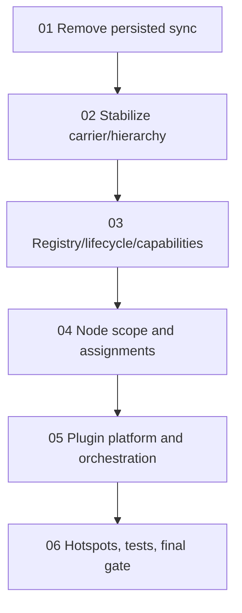

# Phase Plan

## Execution Order

1. `01` - Remove persisted sync and assemble projections
2. `02` - Stabilize node carrier, bindings, and canonical hierarchy
3. `03` - Centralize node-kind registry, lifecycle, and role capabilities
4. `04` - Harden node scope and assignment boundaries
5. `05` - Build plugin platform and cross-module orchestration
6. `06` - Decompose hotspots, add guardrail tests, and rerun the plugin gate review

## Subbundle Dependency Map

## Critical Subbundles

- `01` is the first hard blocker because it removes the biggest remaining parallel truth.
- `02` is the semantic foundation because it keeps node universal while making the carrier stable.
- `03` is the extensibility foundation because it centralizes kind, lifecycle, and assignment semantics.
- `04` protects CRM/HR and future plugins from targeting the wrong node scope.
- `05` is the direct plugin-wave foundation.
- `06` is the final confidence gate.

## Phase Gates

- Prepared gate: `python scripts/validate_bundle.py <bundle-root> --profile initiative --stage prepared`
- Entry gate for each subbundle: all prerequisites complete and still trusted
- Closure gate for each subbundle: required proof artifacts collected and reviewed
- Final closure gate: rerun the canonical-model review in a real .NET environment after SB06
