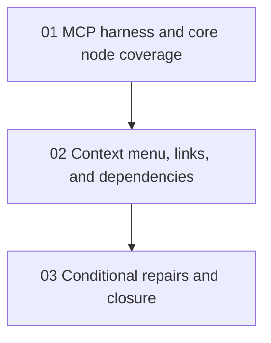

# Phase Plan

## Execution Order

1. `01` - MCP harness and core node coverage
2. `02` - Context menu, links, and dependencies
3. `03` - Conditional repairs and closure

## Subbundle Dependency Map

## Critical Subbundles

- `01` is the critical foundation because the whole bundle depends on real MCP browser proof and a stable local app target.
- `02` is critical because it covers the highest-risk interactive canvas behaviors the user explicitly called out.

## Phase Gates

- Prepared gate: `python scripts/validate_bundle.py <bundle-root> --stage prepared`
- Entry gate before each subbundle: prerequisites complete, source references still trusted, browser target still available
- Closure gate after each subbundle: evidence captured in `reviews/01-execution-report.md`
- Final closure gate: `python scripts/validate_bundle.py <bundle-root> --stage completed`
