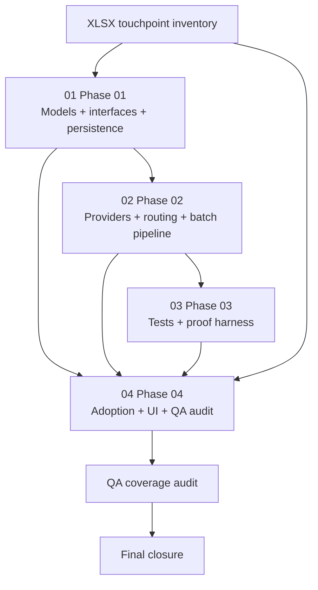

# Phase Plan

## Execution Order

1. Execute Phase 01 to define models, persistence, compatibility seam, and routing contracts.
2. Execute Phase 02 to build registry/factory/services, provider drivers, access route, and transfer pipeline.
3. Execute Phase 03 to build or extend the proof harness: unit, integration, Playwright automation, and manual MCP contract.
4. Execute Phase 04 to adopt the new storage platform across UI and modules, then close the XLSX inventory and QA audit.
5. Finish with the final closure audit and validator reruns.

## Subbundle Dependency Map

- Phase 01 and Phase 02 are the critical technical foundations.
- Phase 03 is a proof foundation: downstream UI/adoption closure is not trustworthy without it.
- The XLSX inventory is both an input and a closure gate artifact.

## Critical Subbundles

| Critical phase | Why critical | Minimum progression proof |
| --- | --- | --- |
| Phase 01 | Defines schema, storage-object model, compatibility seam, and routing contracts. If wrong, later providers/UI proof become untrustworthy. | Build passes + migration plan complete + requirement traceability maps all touched persistence/call-site seams. |
| Phase 02 | Defines actual driver runtime, access route, and capability semantics. If wrong, UI proof can look fine while remote/storage-specific actions still fail. | Targeted unit/integration proof including unified access endpoint behavior and honest provider capability results. |
| Phase 03 | Defines proof harness used to validate all browser-visible adoption. If weak, later screenshots/tests cannot be trusted. | Automated tests land plus manual MCP contract is wired into the execution report and QA prompt. |

## Phase Gates

| Gate | Rule | When it applies |
| --- | --- | --- |
| Prepared bundle gate | Run `validate_bundle.py --stage prepared` and repair any structural issue. | Before execution begins. |
| Phase 01 closure gate | Contracts + persistence + compatibility seam documented in code and migrations, build passes, and traceability stays aligned. | Before Phase 02 starts. |
| Phase 02 closure gate | Registry/drivers/access pipeline land with targeted tests; unsupported proof stays blocked honestly. | Before Phase 03 and any browser-visible adoption closes. |
| Phase 03 closure gate | Unit/integration/Playwright tests and MCP proof contract all exist. | Before Phase 04 is allowed to claim closure. |
| Phase 04 closure gate | Every in-scope XLSX touchpoint row has implementation + proof + checklist coverage, plus manual screenshot findings. | Before final completion is claimed. |
| Final closure gate | Run full validation + QA audit + raw-note closure review. | End of execution. |
