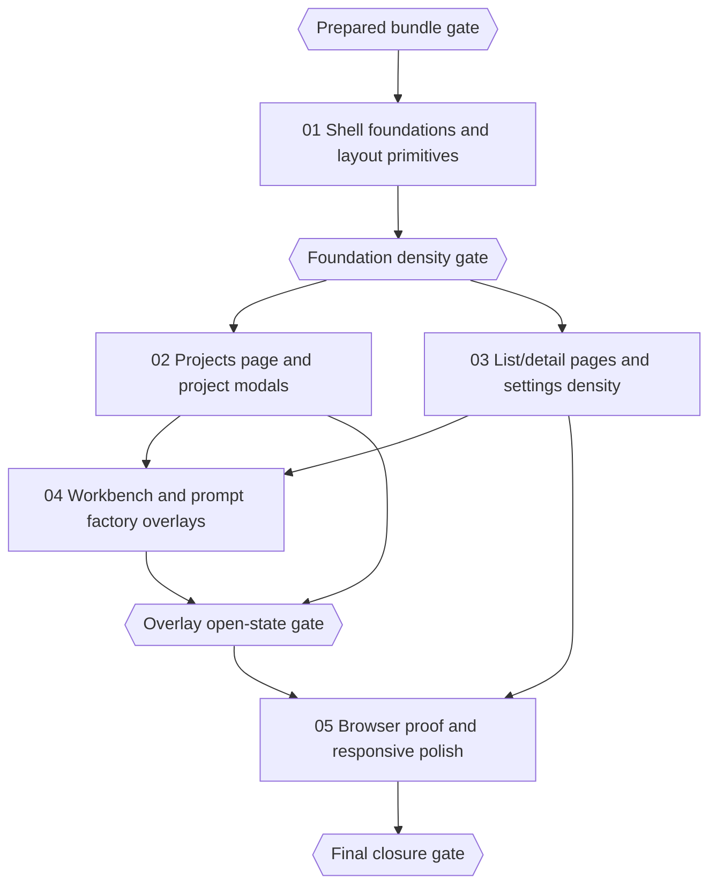

# Phase Plan

## Execution Order

1. **Subbundle 01 — Shell Foundations and Layout Primitives**
   - Widen the shared shell and scaffold surfaces, establish compact header/help patterns, tune shared toolbar and dialog primitives, and verify Tailwind watch.
2. **Subbundle 02 — Projects Page and Project Modals**
   - Fix the user-reported projects density problem and use it as the reference pattern for high-value modal cleanup.
3. **Subbundle 03 — List/Detail Pages and Settings Density**
   - Apply the compact header, summary, and filter-row rules to the repeated operational routes.
4. **Subbundle 04 — Workbench and Prompt Factory Overlays**
   - Tighten custom dialog and overlay systems that do not inherit automatically from the shared dialog shell.
5. **Subbundle 05 — Browser Proof and Responsive Polish**
   - Run cross-route proof, close responsive gaps, and ship final execution analytics and closure notes.

## Subbundle Dependency Map

## Critical Subbundles

- `subbundles/01-shell-foundations-and-layout-primitives`
  - This subbundle changes the shell width budget, shared page header behavior, filter composition, and dialog primitives. Weak proof here invalidates downstream layout claims.
- `subbundles/02-projects-page-and-project-modals`
  - The user’s primary complaint lives here, and the projects route becomes the reference implementation for the rest of the initiative.
- `subbundles/04-workbench-and-prompt-factory-overlays`
  - Overlay open-state quality is easy to fake in closed-state screenshots. Weak proof here would leave modal and overlay layout debt unresolved even if the main pages improved.

## Phase Gates

| Gate | Trigger | Must Be True Before Proceeding | Reopen If |
| --- | --- | --- | --- |
| `Prepared bundle gate` | Before implementation | Validator passes at prepared stage, traceability is complete, and every route/modal family is assigned to a subbundle | Any route or modal family remains unowned or any subbundle lacks a checklist |
| `Foundation density gate` | Before subbundles 02-04 proceed far | Shared shell, header, toolbar, dialog, and Tailwind-watch proof are stable on at least `/projects` and `/settings` | Large-screen width still feels capped, controls do not stretch predictably, or Tailwind watch is not proven |
| `Overlay open-state gate` | Before final closure | Projects/database modals and custom overlay systems are validated in the open state with no clipping or hidden actions | Any overlay still clips, shifts off screen, or sits behind chrome |
| `Final closure gate` | Before completion | Browser analytics, screenshot review, raw-note closure, build/test proof, and final validator pass are all recorded | Any subbundle is still pending, any screenshot review is missing, or a critical route still wastes obvious space |

## Execution Notes

- Keep one managed watch session alive and prefer one nearby edit plus one proof cycle.
- Reuse the same browser session for a route until the current proof is complete.
- Close the startup database modal intentionally during route checks when the goal is page layout, but preserve separate open-state proof for the modal itself.
- If any shared component change forces more route-specific hacks instead of fewer, stop and reopen subbundle 01 rather than pushing the complexity downstream.

