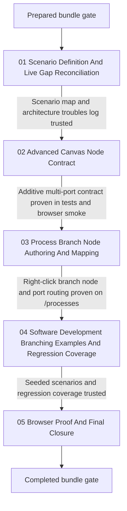

# Phase Plan

## Phase Sequence

1. Prepare the bundle from the live repository, preserve the raw thread request and screenshot reference, and run the readiness validator.
2. Execute `01-scenario-definition-and-live-gap-reconciliation` first so the branch scenarios and architecture trouble list are explicit before any shared canvas refactor begins.
3. Execute `02-advanced-canvas-node-contract` next because every user-visible branch-node behavior depends on an additive multi-port workbench contract.
4. Execute `03-process-branch-node-authoring-and-mapping` only after the shared contract is proven and still additive to legacy canvases.
5. Execute `04-software-development-branching-examples-and-regression-coverage` only after branch-node authoring works in the real process workspace.
6. Execute `05-browser-proof-and-final-closure` last, including raw-note closure, screenshot review, bundle sync, and final validator passes.

## Subbundle Dependency Map

- `01` is the semantic foundation.
- `02` is the shared rendering foundation.
- `03` is the feature-delivery foundation.
- `04` proves the feature on realistic software-development flows.
- `05` closes the original notes and validates browser truth.

## Critical Subbundles

- `subbundles/01-scenario-definition-and-live-gap-reconciliation`
  - This is a critical foundation because later implementation must not silently narrow the requested branch types or the software-development examples.
  - Required deeper validation before downstream work continues: explicit scenario inventory, explicit architecture trouble list, and confirmed mapping from raw notes to implementation surfaces.
- `subbundles/02-advanced-canvas-node-contract`
  - This is a critical UI foundation because later screenshots and route proof are invalid if the port geometry or fallback behavior is wrong.
  - Required deeper validation before downstream work continues: component or renderer tests plus one dependent browser smoke on `/processes`.
- `subbundles/03-process-branch-node-authoring-and-mapping`
  - This is a critical UI foundation because later seeded examples depend on correct branch-node creation and routing behavior.
  - Required deeper validation before downstream work continues: right-click creation proof, route persistence or rebuild proof, and screenshot review of multi-port readability.

## Phase Gates

- Gate after preparation
  - Run `python codex/skills/bundles/candoitall-bundle-preparation/scripts/validate_bundle.py C:\repositories\CanDoItAll\cdi_process_branching_canvas_bundle --profile initiative --stage prepared`.
  - Audit the bundle with the bundle-validator skill and repair any missing dependency, source-reference, or browser-proof planning defects.
- Gate before each subbundle
  - Re-read the current subbundle README, confirm prerequisites, and verify that exact source references still match the repo.
  - Reopen an earlier critical foundation immediately if current observations contradict its proof.
- Gate after each subbundle
  - Update `reviews/01-execution-report.md` with command results, browser analytics, screenshot paths, and the subbundle gate row while evidence is fresh.
  - Run the closure check against the subbundle acceptance checklist and progression gate before starting downstream work.
- Gate before closure
  - Reopen the original raw request, mark each raw note `Solved`, `Partially solved`, or `Not solved`, and cite code plus browser proof.
  - Run the completed-stage validator and pass the final bundle-validator gate before calling the workflow finished.
