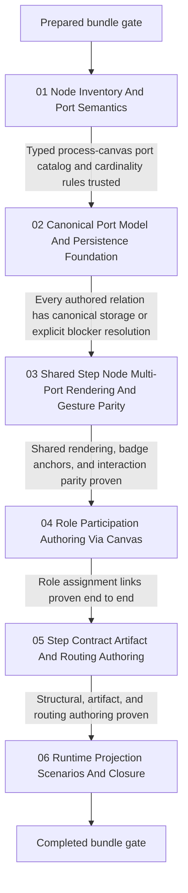

# Phase Plan

## Phase Sequence

1. Finish bundle preparation and run the prepared-stage validator before any product code changes begin.
2. Execute `01-node-inventory-and-port-semantics` first so the analyzed node families, port families, step-kind applicability rules, and cardinality semantics are encoded in a strongly-typed process-canvas contract instead of staying as prose only.
3. Execute `02-canonical-port-model-and-persistence-foundation` next so every graph relationship the canvas will claim to edit has a real canonical home and reload behavior.
4. Execute `03-shared-step-node-multi-port-rendering-and-gesture-parity` only after the process-level port catalog and persistence truth are stable.
5. Execute `04-role-participation-authoring-via-canvas` after the shared UI contract is trusted, because role links are the first generalized non-branch authoring family already backed by canonical storage.
6. Execute `05-step-contract-artifact-and-routing-authoring` after participant links are proven, because this phase depends on the earlier port catalog, persistence foundation, and shared rendering behavior.
7. Execute `06-runtime-projection-scenarios-and-closure` last, including seeded software-development scenarios, regression coverage, Playwright proof, raw-note closure, bundle sync, and final validator passes.

## Subbundle Dependency Map

- `01` is the semantic inventory and code-contract foundation.
- `02` is the canonical-truth and persistence foundation.
- `03` is the shared UI foundation.
- `04` is the first generalized authoring slice backed by existing canonical storage.
- `05` is the richer step and artifact authoring slice.
- `06` is scenario proof, runtime readability, and final closure.

## Critical Subbundles

- `subbundles/01-node-inventory-and-port-semantics`
  - Critical foundation because later implementation must not guess which ports exist, which step kinds they apply to, or which cardinality rules govern them.
  - Required deeper validation before downstream work continues: typed catalog tests or equivalent assertions plus confirmed alignment with `architecture/02-node-port-matrix.md`.
- `subbundles/02-canonical-port-model-and-persistence-foundation`
  - Critical foundation because later UI proof is invalid if authored relations cannot survive save, reload, or projection rebuild.
  - Required deeper validation before downstream work continues: focused integration tests, persistence round-trip checks, and explicit closure on artifact-link modeling.
- `subbundles/03-shared-step-node-multi-port-rendering-and-gesture-parity`
  - Critical UI foundation because every later screenshot and gesture proof depends on shared badge anchoring, port hit-testing, and connector behavior.
  - Required deeper validation before downstream work continues: component or renderer tests plus one dependent browser smoke on `/processes`.

## Phase Gates

- Gate after preparation
  - Run `python C:\Users\lucys\.codex\skills\candoitall-bundle-preparation\scripts\validate_bundle.py C:\repositories\CanDoItAll\cdi_process_canvas_full_authoring_bundle --profile initiative --stage prepared`.
  - Repair any missing section, weak dependency rule, or bad source reference before starting product code.
- Gate before each subbundle
  - Re-read the current subbundle README.
  - Confirm prerequisites are complete and still trusted.
  - Reopen an earlier critical foundation immediately if new observations contradict its proof.
- Gate after each subbundle
  - Update `reviews/01-execution-report.md` with commands, screenshots, browser analytics, and the subbundle gate row.
  - Review screenshots against readability, overlap, alignment, badge-anchor fidelity, and intentional use of space.
  - Confirm the progression gate before starting downstream work.
- Gate before closure
  - Reopen the original request and map each raw note to `Solved`, `Partially solved`, or `Not solved`.
  - Run the completed-stage validator.
  - Do not close the initiative while any claimed canvas-authored relation still depends on form-only fallback for normal use.
