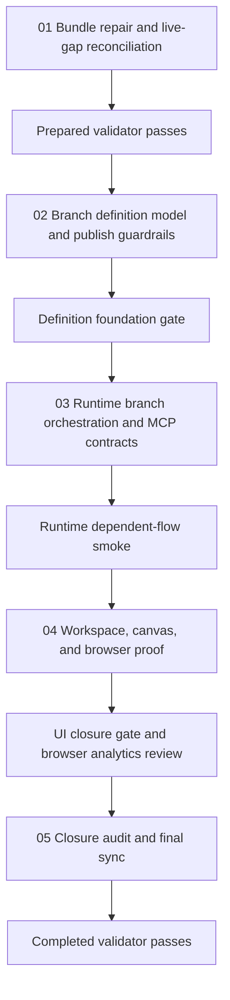

# Phase Plan

## Execution Order

1. Repair the bundle and reconcile the stale audit against the live repository.
2. Run the prepared-stage bundle validator and do not start implementation until it passes.
3. Implement the canonical branch definition model and publish guardrails.
4. Validate the definition foundation before runtime work continues.
5. Implement runtime branch orchestration and MCP contract updates.
6. Run dependent-flow runtime smoke before any UI closure call.
7. Implement workspace and canvas support and capture browser proof.
8. Close the raw notes, synchronize the execution report, and run the completed-stage bundle validator.

## Subbundle Dependency Map

## Critical Subbundles

- `subbundles/01-bundle-repair-and-live-gap-reconciliation`
- This is the execution-scope foundation. If the stale-audit reconciliation is weak, every downstream completion claim becomes suspect.
- `subbundles/02-branch-definition-model-and-publish-guardrails`
- This is the canonical model foundation. If the branch model or publish validation is wrong, runtime and UI proof are invalid.
- `subbundles/03-runtime-branch-orchestration-and-mcp-contracts`
- This is the behavior foundation. If runtime activation and non-selected branch handling are wrong, UI proof becomes theatrical.
- `subbundles/04-workspace-canvas-and-browser-proof`
- This is the critical UI foundation. Later closure cannot stand if the browser proof is weak or misleading.

## Phase Gates

- After subbundle 01:
- Run `validate_bundle.py --profile initiative --stage prepared` and update the root validation summary before any code changes.
- Before subbundle 02:
- Confirm the live-gap reconciliation still supports the narrowed execution scope and that no hidden legacy item must be reopened first.
- After subbundle 02:
- Require passing build or tests for definition-side validation and proof that publish validation rejects invalid branch configurations.
- After subbundle 03:
- Require runtime proof that selected outcomes activate the intended steps and non-selected branches resolve deterministically.
- After subbundle 04:
- Require component or browser proof for both authoring and runtime flows, plus screenshot review answers.
- Before subbundle 05:
- Confirm all execution-report rows are populated from fresh proof, not reconstructed from memory.
- Final gate:
- Run the completed-stage validator and keep the bundle open if any row, status, or raw note remains pending.
