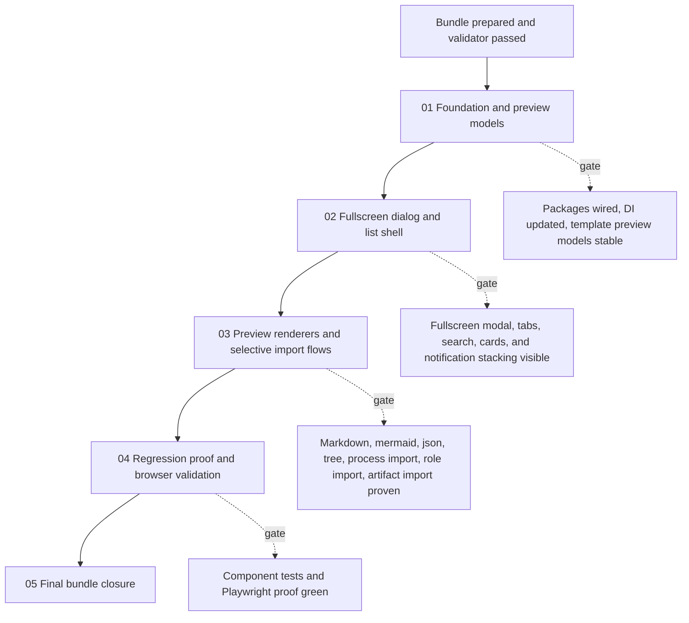

# Phase Plan

## Phase Sequence

1. Prepare and validate the bundle before editing code.
2. Execute `01-library-foundation-and-preview-models`.
3. Run the subbundle gate and only continue when package integration, view-models, and import helpers are stable.
4. Execute `02-fullscreen-template-dialog-and-list-shell`.
5. Execute `03-preview-renderers-and-selective-import-flows`.
6. Run targeted component tests before browser proof.
7. Execute `04-regression-proof-and-browser-validation`.
8. Execute `05-final-bundle-closure` after all proof is captured.

## Subbundle Dependency Map

- No downstream UI work may start until the foundation gate confirms the new package integration and preview models are stable.
- No closure work may start until browser proof captures the modal, preview surfaces, and notification stacking behavior.

## Critical Subbundles

- `subbundles/01-library-foundation-and-preview-models` is critical because it owns the package references, DI, preview models, and import helper seams used by every later phase.
- `subbundles/03-preview-renderers-and-selective-import-flows` is critical because it closes the most behavior-heavy part of the request and defines whether artifact import is usable in the current domain model.
- `subbundles/04-regression-proof-and-browser-validation` is the final technical gate before closure because it proves the external viewer libraries work in the real app shell.

## Phase Gates

- Gate after preparation: run the bundle validator and repair failures.
- Gate before each subbundle: confirm prerequisites are complete and still valid.
- Gate after `01`: build the affected projects and confirm the new service and package seams compile cleanly.
- Gate after `02`: confirm the fullscreen modal opens, the category tabs filter, and notifications are visually above the modal.
- Gate after `03`: run component tests for selective import and confirm preview content resolves from real template files.
- Gate after `04`: review browser screenshots for mermaid rendering, search/filter behavior, direct role import from process preview, artifact import target-step behavior, and toast overlay stacking.
- Gate before closure: rerun validators, update execution report tables, and reopen anything with weak proof.
