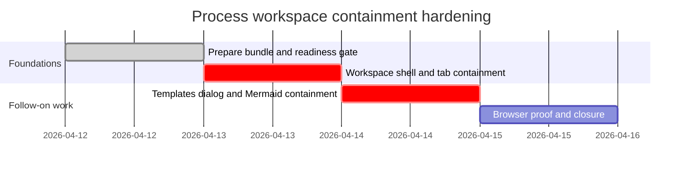

# Phase Plan

## Phase Sequence

1. Prepare and validate the bundle against the live repo state before editing code.
2. Implement the `/processes` page height contract first because the main workspace shell is the critical containment foundation.
3. Implement the templates modal containment and Mermaid viewport fix second, reusing the same shell rules.
4. Run targeted component tests, targeted Playwright proof, and the bundle closure audit.

## Subbundle Dependency Map

- `01-process-workspace-shell-and-tab-containment` must close before modal proof because the same viewport-fit pattern is the governing containment rule for the overall feature.
- `02-template-library-dialog-and-mermaid-viewport-containment` depends on the bundle staying within existing shared layout primitives and must produce browser-visible containment proof before closure work starts.
- `03-browser-proof-and-bundle-closure` depends on both implementation subbundles and cannot start while any UI proof remains weak.

## Critical Subbundles

- `01-process-workspace-shell-and-tab-containment`
- Critical UI foundation. It must prove the page uses `PageScaffold` and `Tabs` as a bounded workspace shell before any downstream modal proof is trusted.
- `02-template-library-dialog-and-mermaid-viewport-containment`
- Critical UI foundation. It must prove both nested-scroll removal and transformed-content containment in the live dialog before closure can rely on screenshots.

## Phase Gates

- Gate after preparation: run `validate_bundle.py --stage prepared` and repair any missing bundle sections before code edits.
- Gate before subbundle 01: confirm the source references still match the live repo and the containment issue is still present in the code structure.
- Gate after subbundle 01: prove internal page containment through targeted tests plus browser review of the `/processes` workspace. Reopen immediately if the document still scrolls for the definition list or tab content.
- Gate after subbundle 02: prove the open templates modal scroll behavior and Mermaid containment on the diagrams tab with screenshot-backed browser evidence.
- Gate before closure: rerun targeted tests, review the screenshot answers, complete raw-note closure, and rerun the bundle validator at completion.
