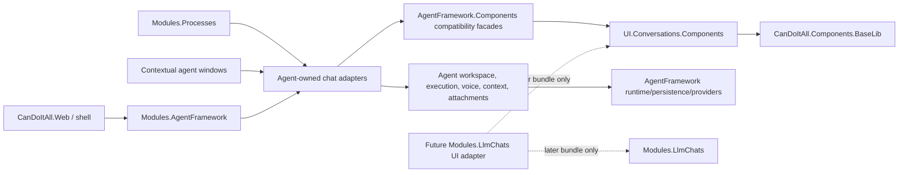

# Target boundary map

## Ownership rules

### Neutral Conversation UI owns

- rendering;
- source-neutral view state;
- local interaction state that has no domain effect;
- formatting and accessibility;
- focused callbacks;
- extension slots;
- safe markdown conversion;
- component-level validation and isolated tests.

### Agent adapters own

- mapping Agent domain/runtime records;
- provider and model catalog mapping;
- session/workspace load;
- send/cancel/approval commands;
- voice;
- attachments;
- prompt gallery;
- context parsing and affinity;
- runtime details;
- lifecycle and persistence effects;
- errors originating from Agent services.

### Product modules own

- routed pages;
- dialogs and product navigation;
- service injection;
- orchestration;
- user-facing product decisions;
- future Simple Chat integration in a later bundle.
