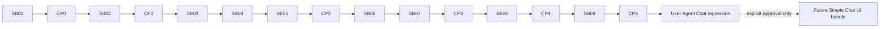

# Execution order and dependencies

```mermaid
flowchart LR
    SB01 --> CP0
    CP0 --> SB02
    SB02 --> CP1
    CP1 --> SB03
    SB03 --> SB04
    SB04 --> SB05
    SB05 --> CP2
    CP2 --> SB06
    SB06 --> SB07
    SB07 --> CP3
    CP3 --> SB08
    SB08 --> CP4
    CP4 --> SB09
    SB09 --> CP5
    CP5 --> User["User Agent Chat regression"]
    User -. explicit approval only .-> Future["Future Simple Chat UI bundle"]
```

No later subbundle may start while its prerequisite checkpoint is blocked or reopened.
