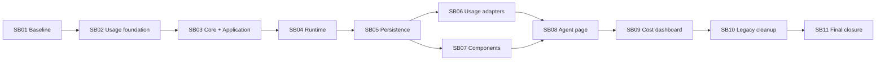

# Phase plan

## Subbundle Dependency Map

## Work units

| SB | Outcome | Proof | Unlock |
|---|---|---|---|
| SB01 | Frozen behavior/caller/schema inventory and accepted target graph | Governed | CP0 |
| SB02 | Typed Usage library and cross-workload contracts | Governed | Core extraction |
| SB03 | Core and Application projects own domain/use cases/ports | Governed | Runtime extraction |
| SB04 | Provider runtime no longer lives in Persistence | Governed | Persistence move |
| SB05 | MAF Persistence, stable schema, append-only pricing evidence | Governed | CP1 |
| SB06 | Agent + Simple Chat source adapters and exact aggregate query | Governed | CP2 |
| SB07 | Reusable MAF Components with behavior parity | Behavioral | Page integration |
| SB08 | Simple Chats adjacent to Agents; /chats redirect; one nav/shell registration | Governed | Page checkpoint |
| SB09 | Both/Agents/Simple Chats scoped cost dashboard/dialogs | Governed | CP3 |
| SB10 | Old projects/namespaces/references removed and composition clean | Governed | CP4 |
| SB11 | Frozen final architecture, Stable, named Playwright and MCP proof | Governed | FINAL |

## Execution Order

1. SB01 and CP0.
2. SB02 through SB06 and CP1/CP2.
3. SB07 may overlap SB06 after CP1.
4. SB08 through SB10 and CP3/CP4.
5. SB11 and FINAL.

## Dependency Map Authority

The Mermaid graph above is authoritative. Manifest prerequisites are machine-validated against it.

## Critical Subbundles

- SB01 freezes assumptions.
- SB02 is the shared usage contract foundation.
- SB03-SB06 are critical architecture/data foundations.
- SB08-SB10 are critical product/composition cutovers.
- SB11 is the only broad/final gate.

Weak proof in any critical subbundle invalidates every downstream consumer.

## Phase Gates

- CP0 after SB01.
- CP1 after SB05.
- CP2 after SB06.
- CP3 after SB09.
- CP4 after SB10.
- FINAL after SB11.

Exact conditions are in plan/architecture-checkpoints.md.

## Parallelism

- SB07 may execute after SB05 while SB06 is active because it consumes Application/Core and does not depend on the aggregate usage implementation.
- No other production subbundles should run concurrently: project moves, namespace cutover, DI, and migrations overlap too heavily.
- Proof generation and read-only caller/test inventory may run in parallel with implementation within the same subbundle.

## Commit policy

- One intentional commit per subbundle after its gate is green.
- Checkpoint commits contain proof/manifests for the exact candidate.
- If the environment cannot commit, record the exact SHA/diff hash and continue only when worktree ownership is unambiguous; do not block the initiative solely on commit mechanics.
- Never combine later-subundle implementation to repair an intermediate phase.

## Execution invariants

- The old and new owners are never both active writers.
- DI registration count remains exactly one per service role.
- HTTP/table/scope compatibility remains stable.
- No new partial class.
- No new project/type cycle.
- Unknown/unpriced cost is never silently normalized to zero.
- Both is a query union, not persisted data.

## Broad-gate trigger

The one SB11 Stable gate is justified by the combined invalidation of public Core/Application namespaces, ProjectReference graph and solution grouping, EF invocation schema/model snapshot/migration, App composition/DI/assembly scanning, and shared Agent page route/component composition. Focused tests cannot bound all consumers of those shared anchors. Stable runs once after CP4 against the frozen candidate; documentation/checksum-only changes do not trigger a rerun.
