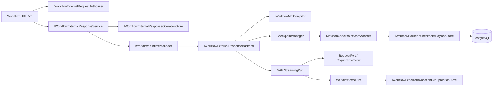

# Architecture Review and Target Boundary

## Executive conclusion

The MAF 1.18 upgrade is mechanically small. The workflow HITL gap is not caused by a missing API route or missing domain enum; it is caused by the MAF adapter terminating execution at an exception boundary instead of allowing MAF to own a pending request and checkpoint.

The target is an adapter completion, not a new workflow subsystem.

## Existing strengths to preserve

- central package version properties;
- separate MAF wrapper and workflow adapter projects;
- typed workflow run/request/outcome contracts;
- persistent run/event/request/checkpoint metadata;
- active-run coordination;
- exact-once request-response acceptance tests at the manager level;
- API endpoints and run detail containing pending requests/checkpoints;
- payload policy and artifact capture;
- stable workflow node IDs used as executor IDs;
- strong agent approval/session tests.

## Existing defects to correct

### A. Exception-as-pause destroys native continuation

`WorkflowExternalRequestPendingException` is useful as a legacy detection mechanism, but it is not a workflow checkpoint protocol. A disposed `Run` cannot be reconstructed from the metadata checkpoint created after the exception.

### B. Metadata checkpoint is mislabeled as a continuation asset

The existing `WorkflowCheckpointRecord` can identify a boundary, but its current in-process content does not reference an actual MAF checkpoint payload. It cannot support `ResumeStreamingAsync`.

### C. Response consumption precedes recoverable continuation

The current manager may mark the request responded before the backend has reached a recoverable state. A crash can leave a response consumed and the run unable to progress.

### D. Approval and human input are conflated only at storage level

Both become `WorkflowExternalRequestRecord`, but they need different response schemas and authorization policies:

- Human input may accept structured user data.
- Approval must accept a constrained approve/deny decision and optional governed comment.
- Approval must not trust any client-supplied copy of the original tool/executor arguments.

### E. Tool concurrency is not an application policy yet

MAF 1.18 introduces an option, but a central CanDoItAll policy is needed so future code does not enable it opportunistically.

## Target component map



## Ownership rules

### Workflow abstractions/core owns

- public workflow/request IDs;
- typed external request and response contracts;
- response-operation state;
- topology fingerprint contract;
- checkpoint payload port expressed as JSON/string/bytes, not MAF types;
- authorization and validation interfaces;
- stable invocation/deduplication key contract;
- runtime transition rules.

### MAF adapter owns

- `RequestPort` creation;
- MAF event interpretation;
- `CheckpointManager`;
- MAF `ICheckpointStore<JsonElement>` adapter;
- construction of `ExternalResponse`;
- streaming run start/resume;
- exact MAF checkpoint IDs;
- translation between MAF request metadata and CanDoItAll records.

### Persistence module owns

- EF entities/configurations/migrations;
- checkpoint JSON payload rows;
- response operation rows;
- compare-and-set claim/lease;
- idempotency/payload hashes;
- invocation deduplication records;
- retention and cleanup primitives.

### Web API owns

- HTTP binding;
- authenticated actor extraction;
- idempotency header parsing;
- status mapping;
- request-size limits;
- OpenAPI/API contract documentation.

The service layer, not the endpoint lambda, owns authorization and acceptance decisions.

## Compiler target

Replace the one-binding-per-node assumption with a small internal binding model capable of representing entry and exit executors.

Suggested internal shape:

```text
MafCompiledNodeBinding
- BusinessNodeId
- Entry
- Exit
- InternalEdges
- RequestPortMetadata
- StableIdentityMaterial
```

Normal nodes use the same executor for entry and exit.

Human input nodes use a native request port as the business boundary.

Approval-required executor nodes use a deterministic internal approval request path before the real executor. The original node input must be checkpointed or carried through MAF's wrapped `ExternalRequest` mechanism; it must not be reconstructed from API response content.

External graph edges connect `source.Exit` to `target.Entry`. Hidden internal executor/port IDs derive deterministically from workflow version + business node ID + role, for example:

- `{nodeId}::hitl-request`
- `{nodeId}::approval-decision`
- `{nodeId}::execute`

Do not use random IDs in compiled topology.

## Approval execution context

When a native approval response authorizes execution, pass a scoped immutable authorization token to the executor invoker. It should bind:

- run ID;
- workflow ID/version;
- node ID;
- external request ID;
- approval response operation ID;
- required capabilities;
- original request payload hash;
- actor;
- decision and timestamp.

The existing approval gate must recognize the valid scoped token and must not issue the same request again. It must reject token reuse for a different node/run/request.

## Checkpoint payload boundary

Add a framework-neutral port similar to:

```text
IWorkflowBackendCheckpointPayloadStore
- CreateAsync(sessionId, checkpointId, parentCheckpointId, ordinal, payloadJson, metadata)
- ListIndexAsync(sessionId) ordered oldest to newest
- ReadAsync(sessionId, checkpointId)
```

The MAF adapter implements `ICheckpointStore<JsonElement>` over this port.

Do not:

- expose `CheckpointInfo` from core contracts;
- serialize MAF objects in API DTOs;
- store only an in-memory `CheckpointManager`;
- assume database row order;
- infer latest checkpoint from GUID sorting.

## Resume algorithm

1. Load the external request and response operation.
2. Acquire/confirm the single resume claim for the run/request.
3. Load the waiting run and exact workflow definition version.
4. Load the checkpoint metadata bound to the request.
5. Verify backend, session, workflow version, request ID, and topology fingerprint.
6. Recompile the workflow with identical stable IDs.
7. Create the MAF JSON checkpoint manager over the application store.
8. Resume a new streaming run from the saved checkpoint.
9. Construct the native MAF response for the saved request/port; never trust client-supplied port/request IDs.
10. Send the response.
11. Consume streaming events until:
    - completed;
    - failed;
    - cancelled;
    - another `RequestInfoEvent` plus checkpoint boundary;
    - a defined execution handoff/timeout.
12. Persist events, checkpoint metadata/payload references, next external request, artifacts, usage, and run transition.
13. Finalize the response operation and request state.
14. Release the claim.

## Exactly-once statement

The implementation may guarantee:

- one accepted response operation per request;
- idempotent replay for the same API key/payload;
- one active resume claim;
- deduplicated invocation of CanDoItAll-governed side-effecting executors.

It must not guarantee exactly-once effects in an arbitrary external system unless that system participates through an idempotency key, transactional outbox, or equivalent protocol.

## Compatibility and migration

- Existing waiting runs created without a real MAF checkpoint cannot be resumed.
- Do not silently restart them.
- Return a typed legacy/non-resumable outcome and preserve them for operator inspection or cancellation.
- New runs after migration use the native checkpoint protocol.
- If a schema discriminator is added, make the legacy/new distinction explicit.

## File-size and composition guard

The baseline compiler, backend, API, and persistent store files are already substantial. Prefer extraction into focused classes:

- `MafWorkflowHitlBindingCompiler`
- `MafWorkflowStreamingRunDriver`
- `MafWorkflowExternalResponseDriver`
- `MafJsonCheckpointStoreAdapter`
- `WorkflowExternalResponseService`
- `PersistentWorkflowCheckpointPayloadStore`
- `PersistentWorkflowExternalResponseOperationStore`
- `WorkflowExecutorInvocationDeduplicationStore`
- endpoint mapping file or partial only if the repository convention genuinely separates compilation units.

Do not move methods into partial files while retaining one untestable dependency cluster.
