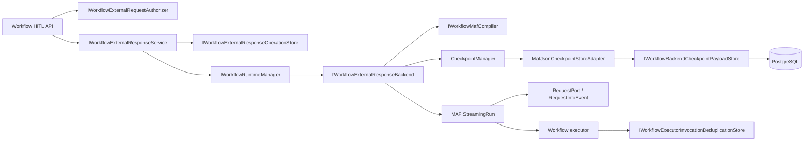

# Architecture Review and Target Boundary

## Executive conclusion

The MAF 1.18 upgrade is mechanically small. The workflow HITL gap is not caused by a missing API route or missing domain enum; it is caused by the MAF adapter terminating execution at an exception boundary instead of allowing MAF to own a pending request and checkpoint.

The target is an adapter completion, not a new workflow subsystem.

## Existing strengths to preserve

- central package version properties;
- separate MAF wrapper and workflow adapter projects;
- typed workflow run/request/outcome contracts;
- persistent run/event/request/checkpoint metadata;
- active-run coordination;
- exact-once request-response acceptance tests at the manager level;
- API endpoints and run detail containing pending requests/checkpoints;
- payload policy and artifact capture;
- stable workflow node IDs used as executor IDs;
- strong agent approval/session tests.

## Existing defects to correct

### A. Exception-as-pause destroys native continuation

`WorkflowExternalRequestPendingException` is useful as a legacy detection mechanism, but it is not a workflow checkpoint protocol. A disposed `Run` cannot be reconstructed from the metadata checkpoint created after the exception.

### B. Metadata checkpoint is mislabeled as a continuation asset

The existing `WorkflowCheckpointRecord` can identify a boundary, but its current in-process content does not reference an actual MAF checkpoint payload. It cannot support `ResumeStreamingAsync`.

### C. Response consumption precedes recoverable continuation

The current manager may mark the request responded before the backend has reached a recoverable state. A crash can leave a response consumed and the run unable to progress.

### D. Approval and human input are conflated only at storage level

Both become `WorkflowExternalRequestRecord`, but they need different response schemas and authorization policies:

- Human input may accept structured user data.
- Approval must accept a constrained approve/deny decision and optional governed comment.
- Approval must not trust any client-supplied copy of the original tool/executor arguments.

### E. Tool concurrency is not an application policy yet

MAF 1.18 introduces an option, but a central CanDoItAll policy is needed so future code does not enable it opportunistically.

## Target component map



## Ownership rules

### Workflow abstractions/core owns

- public workflow/request IDs;
- typed external request and response contracts;
- response-operation state;
- topology fingerprint contract;
- checkpoint payload port expressed as JSON/string/bytes, not MAF types;
- authorization and validation interfaces;
- stable invocation/deduplication key contract;
- runtime transition rules.

### MAF adapter owns

- `RequestPort` creation;
- MAF event interpretation;
- `CheckpointManager`;
- MAF `ICheckpointStore<JsonElement>` adapter;
- construction of `ExternalResponse`;
- streaming run start/resume;
- exact MAF checkpoint IDs;
- translation between MAF request metadata and CanDoItAll records.

### Persistence module owns

- EF entities/configurations/migrations;
- checkpoint JSON payload rows;
- response operation rows;
- compare-and-set claim/lease;
- idempotency/payload hashes;
- invocation deduplication records;
- retention and cleanup primitives.

### Web API owns

- HTTP binding;
- authenticated actor extraction;
- idempotency header parsing;
- status mapping;
- request-size limits;
- OpenAPI/API contract documentation.

The service layer, not the endpoint lambda, owns authorization and acceptance decisions.

## Compiler target

Replace the one-binding-per-node assumption with a small internal binding model capable of representing entry and exit executors.

Suggested internal shape:

```text
MafCompiledNodeBinding
- BusinessNodeId
- Entry
- Exit
- InternalEdges
- RequestPortMetadata
- StableIdentityMaterial
```

Normal nodes use the same executor for entry and exit.

Human input nodes use a native request port as the business boundary.

Approval-required executor nodes use a deterministic internal approval request path before the real executor. Exact MAF 1.18 inspection proves `allowWrappedRequests: true` preserves only an outer request envelope and response data, not the original request payload. Therefore the internal native request checkpoints the immutable original input, and the backend creates a server-owned continuation response from the restored request plus the validated decision. API response content can never supply executor arguments.

`Microsoft.Agents.AI.Workflows.Specialized.RequestInfoExecutor` is internal in 1.18. Application code uses public `RequestPort.Create<TRequest,TResponse>` plus `BindAsExecutor(allowWrappedRequests: false)`.

External graph edges connect `source.Exit` to `target.Entry`. Hidden internal executor/port IDs derive deterministically from workflow version + business node ID + role, for example:

- `{workflowVersionId:N}::{nodeId}::hitl-human-request`
- `{workflowVersionId:N}::{nodeId}::hitl-approval-request`
- `{workflowVersionId:N}::{nodeId}::hitl-approval-continue`

Do not use random IDs in compiled topology.

## Approval execution context

When a native approval response authorizes execution, SB03 passes a scoped immutable authorization token to the executor invoker. The invoker currently enforces:

- an active run ID;
- run ID;
- workflow ID/version;
- node ID;
- executor ID;
- required capabilities;
- approval requirement;
- original request payload hash;
- fixed-time equality of expected and presented approval tokens;
- the approve/deny decision before any executor invocation.

The server-created approval request ID travels with checkpointed context and is not accepted from response JSON. The existing approval gate recognizes only an otherwise valid scoped token and does not issue the same request again. It rejects reuse across the active run, workflow/version, node, executor, capability policy, approval requirement, or input hash.

SB04 has added the durable approval-response operation ID and incorporated it into persisted continuation and invocation identity. SB05 adds trusted actor identity, authoritative decision time, and expiry validation at the common authorization boundary. Those SB05 fields are not SB04 proof claims.

## Checkpoint payload boundary

Add a framework-neutral port similar to:

```text
IWorkflowBackendCheckpointPayloadStore
- CreateAsync(session metadata, optional parent, payload) -> atomically allocated checkpoint ID and commit ordinal
- ListIndexAsync(sessionId) ordered oldest to newest
- ReadAsync(typed session/checkpoint link)
```

The MAF adapter implements `ICheckpointStore<JsonElement>` over this port.

Do not:

- expose `CheckpointInfo` from core contracts;
- serialize MAF objects in API DTOs;
- store only an in-memory `CheckpointManager`;
- assume database row order;
- infer latest checkpoint from GUID sorting.

MAF `ICheckpointStore<JsonElement>.CreateCheckpointAsync` supplies no checkpoint ID or ordinal, so the application store must allocate both atomically. Its three methods expose no cancellation token. `CheckpointManager.CreateJson` receives explicit serializer options for custom request/response state, including out-of-order metadata support required when PostgreSQL `jsonb` does not preserve property order.

The Runtime in-memory implementations are proof-only, process-local, non-durable, and
non-snapshot-isolated. They do not establish host-restart, multi-host race, or transactional
recovery behavior. Production correctness uses the focused EF/PostgreSQL stores as the
authoritative checkpoint, operation, resume-boundary, and invocation state. PostgreSQL
conditional writes, constraints, and transactions establish CAS and atomicity.

## Resume algorithm

1. Load the external request and response operation.
2. Acquire/confirm the single resume claim for the run/request.
3. Load the waiting run and exact workflow definition version.
4. Load the checkpoint metadata bound to the request.
5. Verify backend, session, workflow version, request ID, and topology fingerprint.
6. Recompile the workflow with identical stable IDs.
7. Create the MAF JSON checkpoint manager over the application store.
8. Resume a new streaming run from the saved checkpoint.
9. Call `ResumeStreamingAsync`, then `WatchStreamAsync(blockOnPendingRequest: false)` so MAF republishes the pending request.
10. Verify the restored request/session/port/type against persisted metadata and construct the response through `restoredRequest.CreateResponse(...)`; never trust client-supplied port/request IDs.
11. Send the response.
12. Consume `WatchStreamAsync(blockOnPendingRequest: false)` until:
    - completed;
    - failed;
    - cancelled;
    - another `RequestInfoEvent` plus checkpoint boundary;
    - a defined execution handoff/timeout.
13. Persist events, checkpoint metadata/payload references, next external request, artifacts, usage, and run transition.
14. Finalize the response operation and request state.
15. Release the claim.

## Exactly-once statement

The implementation guarantees exactly-once response acceptance and deduplicated
participating governed effects. Concretely, this comprises one accepted response operation
per request, idempotent replay for the same API key/payload, one active resume claim, and
deduplicated invocation when a governed executor participates in the stable-key protocol.

It must not guarantee exactly-once effects in an arbitrary external system unless that system participates through an idempotency key, transactional outbox, or equivalent protocol.

## Compatibility and migration

- Existing waiting runs created without a real MAF checkpoint cannot be resumed.
- Do not silently restart them.
- Return a typed legacy/non-resumable outcome and preserve them for operator inspection or cancellation.
- New runs after migration use the native checkpoint protocol.
- If a schema discriminator is added, make the legacy/new distinction explicit.

## File-size and composition guard

The baseline compiler, backend, API, and persistent store files are already substantial. Prefer extraction into focused classes:

- `MafWorkflowHitlBindingCompiler`
- `MafWorkflowStreamingRunDriver`
- `MafWorkflowNativeStartDriver`
- `MafWorkflowExternalResponseDriver`
- `MafWorkflowTurnResultMapper`
- `MafJsonCheckpointStoreAdapter`
- `WorkflowExternalResponseService`
- `PersistentWorkflowCheckpointPayloadStore`
- `PersistentWorkflowExternalResponseOperationStore`
- `WorkflowExecutorInvocationDeduplicationStore`
- focused endpoint mapping file.

Do not move methods into partial files while retaining one untestable dependency cluster.

## CP-WB1 source architecture closure review

Source architecture status: **Pass** on 2026-08-21. SB03 and CP-WB1 are Proven / Pass.

Final focused CodeAnalytics snapshot: `snap-20260821002934-bf844210`.

- The scoped project graph remains acyclic, no project-reference edge was added, and the two recorded baseline non-project cycles are unchanged.
- MAF SDK dependencies remain isolated to the adapter edge.
- `MafWorkflowNativeStartDriver` owns native HITL start orchestration.
- `MafWorkflowExternalResponseDriver` is response-only and owns exact-version rehydration plus native response delivery.
- `MafWorkflowTurnResultMapper` cohesively owns waiting/terminal turn projection and is shared by both drivers.
- `MafWorkflowTurnResultMapperTests` directly covers incomplete-boundary rejection and waiting/terminal projection without the backend or runtime manager.
- The implementation introduces no handwritten production partial, nested extracted service, service locator, or new project boundary.

## CP-WB2 durable state-machine closure review

Architecture status: **Pass** on 2026-08-21. SB04 and CP-WB2 are Proven / Pass; SB05 has
subsequently passed CP-WB3.

Final focused CodeAnalytics snapshot: `snap-20260821044013-44e660f5`.

- The snapshot covers 9 projects and 478 documents, reports no project cycle, and retains
  exactly the same two named baseline non-project cycles.
- Neutral Runtime/Core/Abstractions remain free of MAF, EF, and Npgsql; focused
  `Modules.AgentFramework` types own EF/PostgreSQL persistence.
- `WorkflowRuntimeManager` is 738 lines versus the 748-line baseline. Public entry points
  are thin factory delegates, response submission is a one-line delegate, and the
  compatibility construction path is test-only.
- Operation transitions, submission/continuation, lease heartbeat, persistent stores, and
  the executor dedup decorator are focused top-level collaborators with direct tests. No
  handwritten production partial, nested extraction, service locator, or append-only
  persistence-cluster growth was introduced.
- Production composition resolves persistent ports and exactly one decorator around the
  existing invoker. The explicit in-memory composition profile proves registration only;
  it is not durability evidence.
- Migration `20260821021747_AddWorkflowHitlRecovery` has no pending model changes. The
  immutable Unit selector passes 419/419 and the exact PostgreSQL/composition Integration
  selector passes 16/16. Ten affected Release project builds and the final post-fix
  Release Unit build pass with zero warnings and zero errors.
- The supported guarantee is exactly-once response acceptance and deduplicated
  participating governed effects. Arbitrary external exactly-once behavior remains
  explicitly outside the boundary.

## CP-WB3 governed API closure review

Architecture status: **Pass** on 2026-08-21. SB05 and CP-WB3 are Proven / Pass; SB06
subsequently passed CP-WB4.

Final focused CodeAnalytics snapshot: `snap-20260821072204-bf844210`.

- The project graph has zero cycles and unchanged project references relative to SB04;
  exactly the same two baseline non-project cycles remain. Core/Runtime retain no
  ASP.NET, EF/Npgsql, or MAF dependency, and Web has no persistence-entity or MAF edge.
- One neutral `IWorkflowExternalResponseService` facade owns response orchestration.
  Authorization, validation, durable-grant reconstruction, pure result mapping, bounded
  startup recovery, and the background worker are focused top-level collaborators with
  direct tests; no second manager, partial split, nested service, or service locator was
  introduced.
- The Web POST, agent runtime tool, and `WorkflowsPage.razor.cs` are exactly the three
  production response callers and all use the common service. Production raw manager or
  compatibility-coordinator response submission is absent.
- Web-owned endpoint, reader, mapper, and DTO types own strict typed JSON, exact response
  scope, OpenAPI metadata, and safe run/event/SSE/artifact/checkpoint/pending/operation
  projections. Protected payloads, raw domain JSON, native checkpoint data, hashes,
  storage paths, credentials, governed arguments, and policy material are not public DTOs.
- Modules.AgentFramework owns current-profile/scope/capability authorization and
  persistence composition. Initial and startup/lease recovery reconstruct and revalidate
  durable authorization from operation plus request-boundary evidence before native
  continuation or executor delivery.
- No SB05 relational schema or model-snapshot change exists; existing `OriginJson` and
  `AuthorizationPolicyJson` carry server-owned scope/policy additions, while the SB04
  operation carries actor, time, fingerprint, protected payload, and audit outcome.
- The exact final selectors pass 297/297 Unit and 137/137 Integration with zero skipped
  tests. Real authenticated Web -> service -> PostgreSQL -> MAF completion/replay and real
  scope, changed-payload, and cancellation adversarial paths pass. All affected Release
  builds complete with zero warnings and zero errors.
- Governed evidence under `proof/SB05` records the source/schema/API freeze, progression
  failures, passing proof, no-bypass/no-migration assertions, production composition,
  static validation, and strict architecture review.

## CP-WB4 final frozen closure review

Architecture status: **Pass** on 2026-08-21. SB06 and the parent bundle are Proven.

- Final focused snapshot `snap-20260821092959-44e660f5` covers 9 projects and 499
  documents, reports no blocking error or project cycle, and retains exactly the two
  unchanged baseline non-project cycles. The later broad-diagnostic repairs add no project
  or package reference.
- Implicit plugin assembly discovery now accepts only visible, concrete, closed executor
  types. This is an export-boundary correction: explicit type registration is unchanged,
  and private nested test helpers can no longer become accidental runtime plugins.
- In-memory native-resume compatibility uses an internal typed
  `IWorkflowRedactedExternalResponseAcceptanceStore` capability. The public non-empty
  response contract remains intact, source request records persist blank response JSON,
  protected operation state retains the payload, and native compatibility fails during
  construction when the capability is missing. Legacy no-checkpoint compatibility remains
  supported.
- `InMemoryWorkflowExternalResponseCancellation` owns the extracted cancellation
  transition plan. The extraction restores the existing source-file budget without
  increasing it, adding a partial, moving decisions into tests, or changing the public
  contract.
- The Components change is test composition only: the shared bUnit harness now installs
  authorization state and the production AgentFramework UI service composition before
  per-test overrides. It does not add a UI-layer business-logic path.
- The safe start/API contract explicitly excludes the idempotency-key hash. The event
  normalizer exposes only public node/event text while retaining unresolved native source
  identity as internal payload metadata.
- Windows process-host adjustments are deterministic readiness fixtures, not product
  behavior or a relaxed assertion: the suite is serialized and fails explicitly when a
  child never publishes its identity.
- Append-only SB03/SB04/SB05 supplements record the native-event redaction and PostgreSQL
  precision/lease reproof. Frozen parent manifests, ledgers, and TRXs remain historical and
  unmodified.
- The valid frozen FG-01 state at
  `af425ac371b251447f9858b15476092531c686da` passes both Release solution builds with
  zero warnings/errors and the exact Stable selector at 8,471/8,471 with zero failed or
  skipped tests. Components and FileTools remained pinned at the recorded commits.

The final boundary statement is unchanged: exactly-once response acceptance and
deduplicated participating governed effects are supported; arbitrary external exactly-once
execution is not. Production restart/multi-host correctness comes from PostgreSQL CAS,
constraints, and transactions. In-memory implementations remain process-local,
non-durable, and non-snapshot-isolated.
