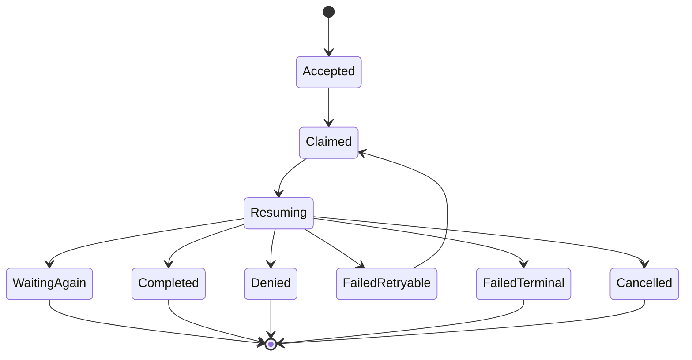
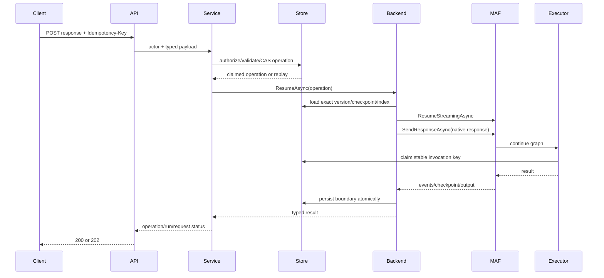

# Workflow HITL State Machine

## Run states

Preserve the public `WorkflowRunState` enum when possible. A response-operation record supplies the finer-grained state.

Relevant run states:

- `Running`
- `WaitingForInput`
- `Completed`
- `Failed`
- `Cancelled`

During resume, the persisted run may transition from `WaitingForInput` to `Running`. If adding a public `Resuming` state would be breaking or create broad UI/API impact, expose `Resuming` through operation status rather than forcing an enum expansion.

## External request states

Recommended conceptual states:

- `Pending`
- `ResponseClaimed`
- `Responded`
- `Denied`
- `Superseded`
- `Cancelled`
- `LegacyNonResumable`

The existing `RespondedAtUtc` alone is insufficient for recovery. Implement either explicit state fields or a separate immutable response-operation ledger.

## Response operation states

Recommended persisted fields:

- operation ID;
- external request ID;
- run ID;
- idempotency key hash;
- response payload hash;
- redacted or policy-protected response payload/reference;
- actor kind and actor ID;
- correlation/trace ID;
- expected request version;
- state;
- attempt;
- lease owner and lease expiry;
- accepted, claimed, started, completed timestamps;
- outcome code and safe message;
- produced checkpoint/request/run references;
- concurrency token.

## API acceptance transition

The transaction or compare-and-set operation must:

1. verify request exists and is pending;
2. verify run is waiting on that request;
3. verify idempotency key uniqueness;
4. compare payload hash for replay;
5. create or return the response operation;
6. claim the run/request for one resume;
7. avoid permanently finalizing the request before a recoverable operation exists.

Outcomes:

- same key + same payload + same request: return current operation result;
- same key + different payload: conflict;
- different key after completed response: already responded/conflict;
- active operation with another key: conflict or accepted-status response according to API convention;
- stale request version: conflict;
- missing/non-resumable checkpoint: typed unprocessable or terminal recovery failure;
- unauthorized actor: forbidden without leaking request content.

## Runtime resume transition

## Stable identity requirements

Checkpoint rehydration requires identical topology and executor identities. Persist and verify:

- workflow ID;
- workflow version ID;
- compiler contract version;
- topology fingerprint;
- MAF session ID;
- request port ID;
- MAF request ID;
- latest usable checkpoint ID;
- checkpoint format version;
- relevant component/executor identity snapshot or source hash.

Fingerprint input must be deterministic and exclude timestamps or dictionary iteration order.

A mismatch returns a typed `TopologyMismatch`/`CheckpointIncompatible` outcome. Never attempt a best-effort restart.

## Consecutive requests

The resumed stream may emit another `RequestInfoEvent`.

Required behavior:

1. persist the new request;
2. persist the checkpoint committed for the new boundary;
3. transition run back to `WaitingForInput`;
4. finalize the prior response operation as `WaitingAgain`;
5. ensure the prior request is responded and the new request is pending;
6. return both run and next-request status through API detail.

## Approval denial

For an approval request:

- response schema contains `approved: boolean` and optional bounded comment/reason;
- denial does not execute the governed executor;
- workflow routing determines whether denial:
  - produces a typed denied node result;
  - follows a denial edge;
  - completes as a governed cancellation;
  - fails only when the workflow definition says denial is failure.

Do not throw an untyped exception merely because the user denied approval.

## Cancellation

While waiting:

- cancellation wins against a new response claim through compare-and-set;
- pending request becomes cancelled/superseded;
- later response returns conflict/gone;
- no checkpoint resume occurs.

While resuming:

- active-run cancellation token reaches MAF;
- final state cannot be overwritten by a late completion;
- response operation records cancellation outcome.

## Failure classes

### Retryable

- transient database/network failure before MAF response delivery;
- lease expiry with no active executor;
- transient provider failure when replay is safe and executor deduplication exists.

### Terminal

- checkpoint missing/corrupt;
- topology/version mismatch;
- request/port mismatch;
- response schema incompatible;
- security/authorization violation;
- deterministic executor failure;
- unsupported legacy waiting run.

Retry policy must not convert terminal failures into reruns from initial input.

## Legacy waiting runs

Runs created before native checkpoint support may contain only metadata checkpoints.

Required response:

- classify as legacy non-resumable;
- leave evidence intact;
- allow inspection and cancellation;
- do not mark response accepted;
- do not restart;
- document an operator decision path.
