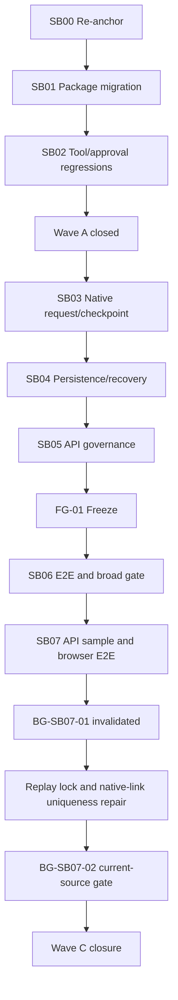

# Dependency Graph

## Critical foundations

- **CF-01:** correct MAF 1.18 package graph — lent by SB01.
- **CF-02:** serial tool and approval behavior — lent by SB02.
- **CF-03:** native MAF checkpoint can rehydrate a disposed run — lent by SB03.
- **CF-04:** persistent response operation and deduplication survive replay — lent by SB04.
- **CF-05:** authorized API reaches the same service boundary — lent by SB05.
- **CF-06:** safe request presentation and public API/SSE behavior are consumable by a standalone client — proven by SB07.
- **CF-07:** request-operation replay and same-session native checkpoint linkage serialize
  authoritatively in PostgreSQL — focused proof and BG-SB07-02 broad Integration evidence pass.

## Safe parallelism

Within SB00, independent read-only discovery may run in parallel.

After SB01:

- documentation of release changes may proceed independently;
- implementation in SB02 remains sequential with package stabilization.

Within Wave B, avoid parallel edits across:

- workflow contracts;
- runtime manager;
- MAF backend;
- persistent store;
- API DTOs.

These form one dependency chain and overlapping edits are likely to invalidate assumptions.

Test fixture work may proceed in parallel only after the owning public contracts are frozen and file ownership does not overlap.

## Revalidation propagation

- Reopen SB01 when package versions or MAF API signatures change.
- Reopen SB02 when agent option construction or custom chat-client composition changes.
- Reopen SB03 when workflow compiler topology, MAF request-port identity, or checkpoint format changes.
- Reopen SB04 when persistence schema, state transitions, or invocation key material changes.
- Reopen SB05 when auth conventions, API DTOs, or public outcomes change.
- Any reopened critical foundation invalidates SB06 proof.
- A Wave C finding reopens SB05 only when it contradicts the owned public API guarantee;
  otherwise SB07 repairs and revalidates its bounded additive projection independently.
- A response-operation lock-order or native-link index/model change invalidates the current
  Wave C gate. `BG-SB07-01` is therefore retained as invalidated and cannot be reused.
- Migration `20260822013043_AddWorkflowNativeCheckpointRequestUniqueness` triggers one full
  Integration-project run at `BG-SB07-02` after focused 61/71/64 validation passes. Historical FG-01
  remains immutable and is not rerun.
