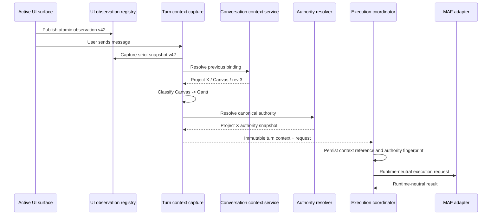
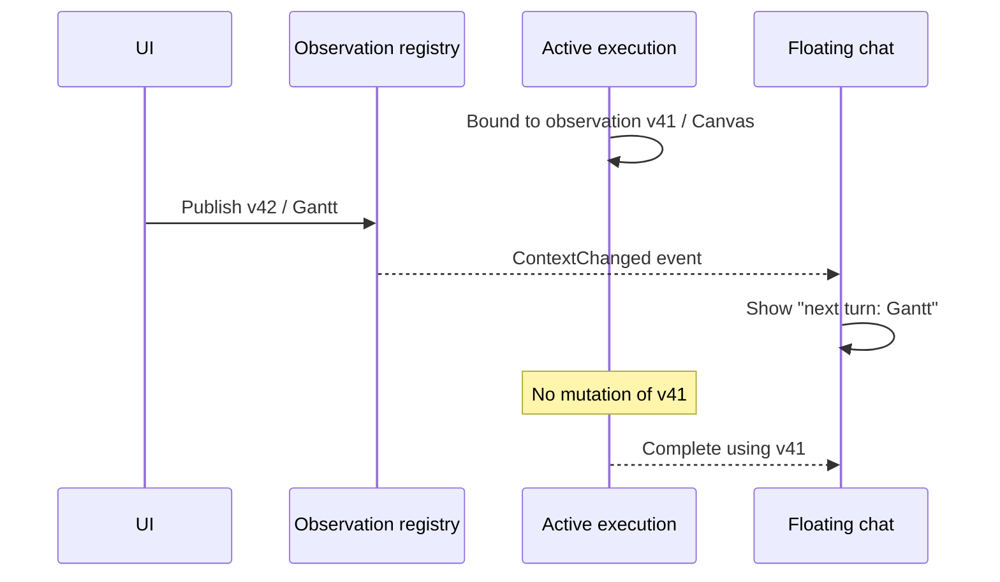
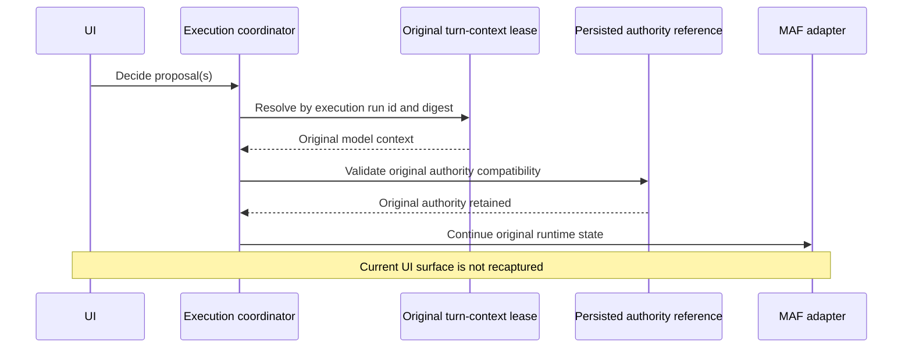
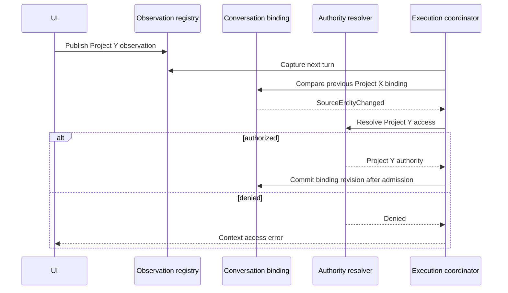
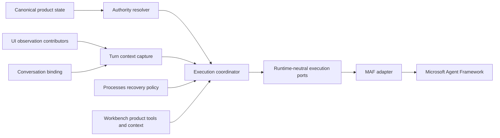
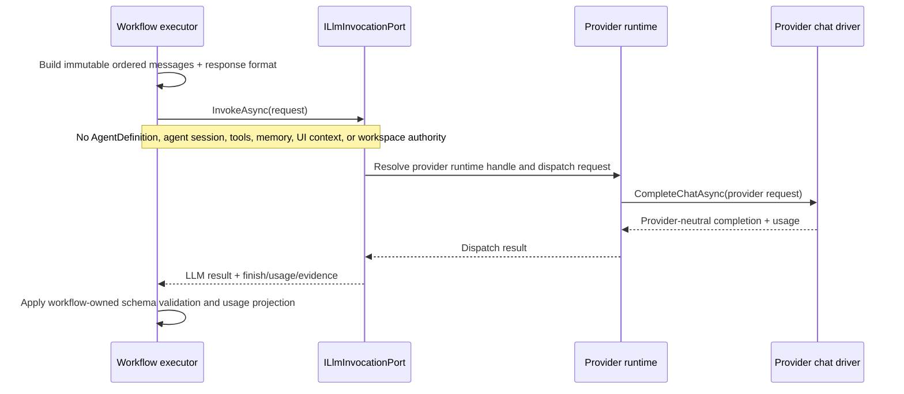
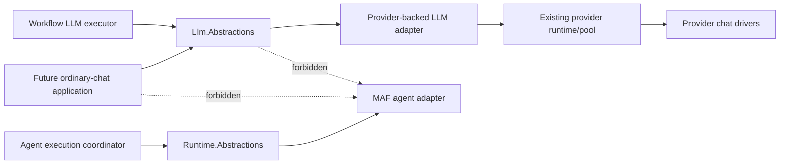

# Runtime and context sequences

## New floating turn



## UI changes during a run



## Approval continuation



## Cross-project transition



## Target adapter boundary



## Ordinary workflow LLM invocation



## Future ordinary LLM conversation

```mermaid
sequenceDiagram
    participant UI as Ordinary chat UI
    participant CONV as LLM conversation service
    participant STORE as Conversation store
    participant LLM as ILlmInvocationPort
    participant PR as Provider runtime

    UI->>CONV: Send user turn
    CONV->>STORE: Load transcript and conversation policy
    STORE-->>CONV: Ordered transcript + provider/model choice
    CONV->>LLM: Stateless invocation request
    LLM->>PR: One provider dispatch
    PR-->>LLM: Completion + usage
    LLM-->>CONV: Stateless result
    CONV->>STORE: Atomically persist user/assistant turn and usage
    CONV-->>UI: Updated conversation
    Note over CONV,LLM: Transcript and compaction stay above the stateless port; this is not an agent run
```

## Target inference boundaries


