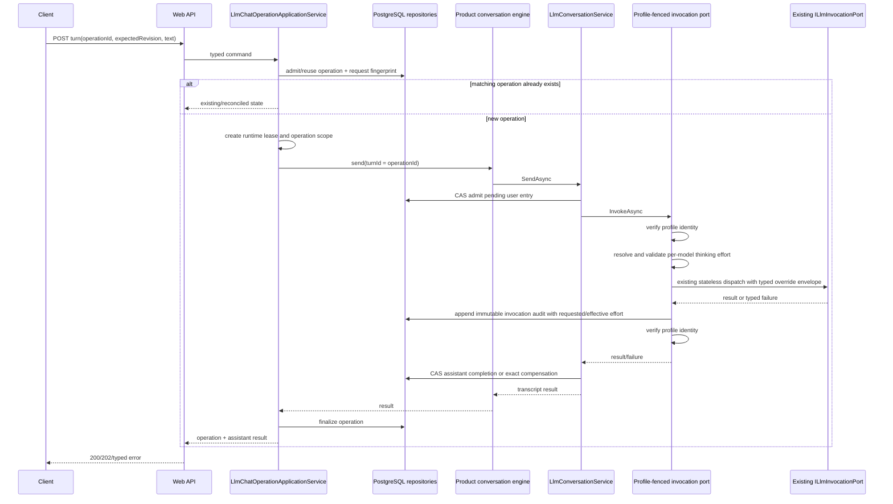

# Turn data flow

## New turn

## Profile switch during dispatch

1. database switch notification cancels the runtime lease;
2. provider call receives the linked cancellation token where possible;
3. the fenced port verifies identity after dispatch even if the provider ignored cancellation;
4. it records known usage/outcome;
5. it throws a typed fence failure;
6. generic service compensates the exact pending user entry;
7. transcript store checks the lease before mutation;
8. operation becomes failed/cancelled/recovery-required according to persisted evidence.

No result is silently committed into a newer profile.

## Crash reconciliation

Because operation ID equals turn ID, recovery can distinguish:

- completed assistant entry;
- active pending user entry;
- fully compensated/no-entry failure;
- conflicting foreign turn.

This identity is the core recovery invariant.
