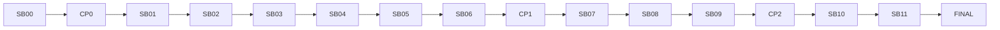

# Dependency graph

## Critical path

`SB00 -> CP0 -> SB01 -> SB02 -> SB03 -> SB04 -> SB05 -> SB06 -> CP1 -> SB07 -> SB08 -> SB09 -> CP2 -> SB10 -> SB11 -> FINAL`

No parallel implementation is authorized before CP1 because the API depends on locked backend
semantics.
