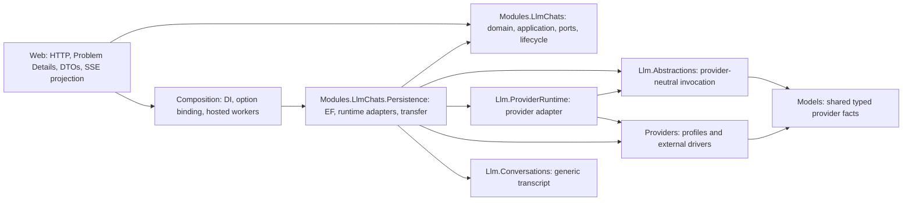

# C# Boundary Map

## Target Ownership

## Boundary Rules

- Core owns stable error codes, operation/recovery semantics, options contracts, and repository/runtime ports. It has no EF, ASP.NET, Razor, or Composition reference.
- Persistence owns transaction isolation, row locks/CAS translation, event high-water storage, cleanup queries, and transfer materialization.
- Web owns route validation, authorization metadata, Problem Details, read/manage projections, and wire DTO allowlists. It does not query `AppDbContext` or depend on Persistence.
- Composition owns `IOptions` binding/validation and hosted worker fan-out. It does not implement product decisions.
- ProviderRuntime owns adaptation of provider drivers to provider-neutral invocation and safe logging; LLM Chats may not fork a second provider runtime.
- System-prompt confidentiality is enforced in the public product read query/projection; provider execution still consumes the pinned system instruction through existing internal contracts.

## Local Web Extraction

- Keep `LlmChatsApi.MapLlmChatsApi` as the public/internal composition entry point called by the host.
- Create separate internal definition and conversation endpoint owners in the same Web project.
- Shared `LlmChatApiContracts`, mapper, cursor codec, and results remain shared only when genuinely common.
- Do not use partial classes and do not create endpoint interfaces.

## Data Ownership

- PostgreSQL operation row owns durable status, dispatch/lease/cancellation data, result pointers, and event high-water.
- Operation-event rows own retained replay frames, not the durable cursor high-water.
- Invocation rows own bounded sanitized attempt facts; provider driver exceptions/raw bodies never enter them.
- Definition revision owns the sensitive system prompt. A manage-scoped editor DTO may project it; read scope and transcript DTOs may not.

## Deferred Boundaries

- Caller identity/idempotent conversation creation belongs to a future deployment/identity boundary.
- UI composition belongs to a separate bundle.
- Organization/user ownership, moderation, retrieval, and external channels are not silently attached to this module.
