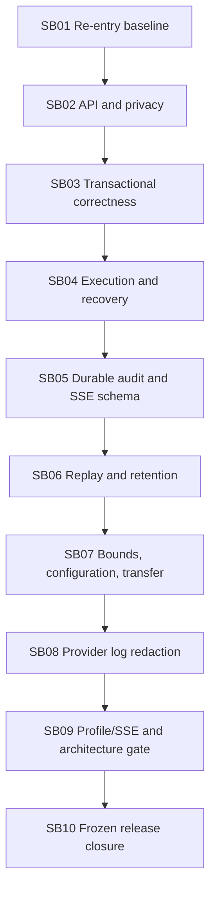

# Phase Plan

## Execution Order

1. SB01 — current-state reconciliation and executable baseline.
2. SB02 — API contract correctness and transport ownership.
3. SB03 — transactional command correctness.
4. SB04 — execution supervision and recovery.
5. SB05 — durable audit and SSE contract.
6. SB06 — replay, retention, and transient state.
7. SB07 — bounded dispatch, configuration, and transfer.
8. SB08 — provider failure redaction, after SB07. It is serialized because SB05 and SB08 both change the shared ProviderRuntime adapter/contract path.
9. SB09 — profile/SSE regression and architecture checkpoint, joining both lanes.
10. SB10 — frozen release evidence and closure.

## Subbundle Dependency Map

## Critical Subbundles

- SB01 is critical because all old proof commands, heads, and some requirements are stale. Any unexplained drift blocks every implementation unit.
- SB03 is critical because later lifecycle, audit, and SSE proof cannot be trusted if canonical transactions or idempotent replay are wrong.
- SB04 is critical because no downstream evidence may leave a provider task unowned or claim unsafe recovery.
- SB05/SB06 are critical because retained SSE/API evidence must agree with canonical operation state.
- SB09 is the final focused backend checkpoint and architecture trust boundary before the broad gate.

## Parallel-Safe Work

- No implementation subbundles are declared parallel-safe. SB05 and SB08 overlap the shared ProviderRuntime adapter and are serialized; SB02-SB07 share evolving operation/API/persistence contracts.
- Read-only review or proof verification may run in parallel, but one executor owns all source/test/documentation edits for the active subbundle.
- SB02-SB07 are intentionally serial because they share operation/API/persistence contracts and migration/transfer surfaces.

## Development Validation Rule

For every implementation subbundle:

1. Record the start commit and changed-file reservation.
2. Write/run the named failing-first positive/negative case through the owning lane.
3. Build each changed production project directly in Release.
4. Run `dotnet test <lane>.slnx --configuration Release --list-tests --filter <filter> /m:1` and record expected versus actual discovery.
5. Run the same filter with `--no-build --no-restore` only after the owning assembly was refreshed.
6. Capture canonical durable/API/log state, not only status/count.
7. Update the execution ledger and apply reopen rules before another dependent unit starts.

Do not run the broad Stable aggregate during SB01-SB09.

## Phase Gates

- CP0 after SB01: current source/test/build graph and inherited behavior are classified; no unexplained failure or drift.
- CP1 after SB04: canonical transactions, idempotent replay, cancellation, task ownership, and recovery pass.
- CP2 after SB08: API/privacy, audit/SSE, retention, capacity/configuration, transfer, and provider logging pass with migration parity.
- CP3 after SB09: current profile-bound SSE/DI behavior and C# architecture gate pass at the candidate head.
- FINAL at SB10: one broad local gate and same-commit three-OS CI pass.

## Broad-Gate Decision

- Required once at SB10's frozen checkpoint.
- Named invalidation trigger: the union changes shared ProviderRuntime behavior, Web API contracts, Composition/DI/hosted services, PostgreSQL repositories/schema/migrations/transfer, and test topology/evidence. This crosses focused project boundaries and is release closure work.
- If the frozen commit changes after the broad gate begins, discard that run as closure proof and create a new single frozen checkpoint. Do not stack “mostly same commit” results.

## Global Reopen Triggers

| Later change/finding | Reopen |
| --- | --- |
| Test solution, namespace, filter, or test data changed | Owning discovery/proof and every downstream checkpoint using it |
| Domain/application lifecycle or error code changed | SB03, SB04, SB05-SB10 |
| Provider execution/cancellation/runtime lease changed | SB04, SB05, SB08-SB10 |
| Operation/event entity, migration, repository, transfer changed | SB05-SB10 |
| Web route/DTO/auth/Problem Details changed | SB02 plus affected SB04/SB05/SB09/SB10 |
| SSE writer/session/replay changed | SB05/SB06/SB09/SB10 |
| DI lifetime, hosted service, configuration, source graph, `Directory.Build.*`, or CI changed | SB07/SB09/SB10 |
| New project/reference/interface/partial type | architecture re-entry before implementation continues |
| Any raw secret appears in API/log/proof artifact | SB02/SB05/SB08/SB09/SB10; stop release |

## Stop Conditions

- A safe resolution requires a new deployment identity/tenant aggregate.
- A live provider or UI change appears necessary to prove a backend requirement.
- Database recovery would require redispatching an ambiguous post-dispatch operation.
- A new architectural boundary is needed but has not passed the architecture re-entry review.
- PostgreSQL, source dependencies, or CI authority are unavailable for the owning required gate. Record a blocker; do not replace real-boundary proof with an in-memory substitute.
