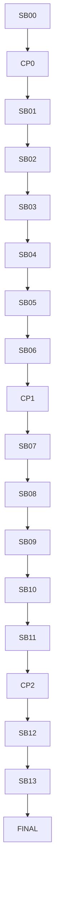

# Simple LLM Chats — Follow-up Hardening and SSE

Status: **Prepared**  
Repository: `fyziktom/CanDoItAll`  
Feature branch reviewed: `simple-chats` at `16b6aa4b60dc88a6134dd6c9c9e634c064ac5847`  
Development reviewed: `eb6be3ea38075b442d24976655f5c45ac08bd6b5`

## Verdict

The first backend/API implementation is a strong foundation, but it is **not ready for UI integration or
merge closure yet**. It correctly introduced a separate Simple Chat product module, immutable definition
revisions, PostgreSQL persistence, durable operations, provider ownership cleanup, and focused API tests.

The review found blocking defects in atomicity, recovery, profile identity, distributed ownership, request
lifetime, read scalability, and audit consistency. The committed original closure also records a red final
stable gate.

True provider streaming and SSE belong in this follow-up, but only after CP1 proves the corrected
non-streaming backend. Streaming must not be layered over a protocol that can double-dispatch, cross a
database profile generation, or commit contradictory state.

## Blocking findings summarized

1. The apparent shared unit of work is not shared: `EfLlmConversationStore` creates its own
   `AppDbContext` and transaction.
2. Admission, transcript changes, operation evidence, audit, compensation, and terminal state are split
   across independent commits.
3. Compensation exhaustion can be swallowed while an active turn remains.
4. Durable cancellation can still race into `Succeeded`.
5. Idempotent replay is resolved only after mutable definition/conversation lifecycle checks.
6. The profile fence surrounds only provider/transcript execution, not the complete use case.
7. Process-local liveness can cause one instance to recover another instance's live operation.
8. The synchronous POST and its cancellation token own the paid operation lifetime.
9. Transcript/list reads are full-document or N+1.
10. Provider retry attempts and timeout/cancellation audit reduction are inconsistent.
11. The branch is behind current development and the prior stable gate remains red.

## Target outcome

After SB13 the branch must provide:

- one canonical conversation/transcript truth and real atomic PostgreSQL commands;
- deterministic idempotency, cancellation, compensation, recovery, and usage audit;
- whole-use-case profile fencing;
- durable multi-instance execution ownership and request-independent dispatch;
- bounded keyset/read-model queries;
- true incremental OpenAI, Azure OpenAI, and Ollama streaming;
- a durable, bounded, replayable per-operation event journal;
- `202 Accepted` turn admission plus SSE with `Last-Event-ID`, gaps, heartbeat, profile lifetime, and
  terminal closure;
- API scope enforcement, server-owned origin, stable redacted DTOs;
- focused behavioral proof and one final stable gate/CI matrix run.

## Execution order



Streaming is locked until CP1 is Ready. Shared-component isolation and UI work remain locked until FINAL
is Ready.

## Start here

1. Read `CODEX-EXECUTION-CONTRACT.md`.
2. Read `analysis/01-findings-register.md` and `architecture/`.
3. Execute only the current unlocked subbundle.
4. Update `bundle-status.json`, `EXECUTION-PROGRESS.md`, proof manifests, and checkpoint reviews.
5. Run:

```powershell
python ./scripts/validate_bundle.py --bundle-root .
python ./scripts/check_traceability.py --bundle-root .
python ./scripts/check_test_policy.py --bundle-root .
```

After source changes begin, run the architecture and SSE source guards with the actual repository root.

## Hard stops

Stop and reopen the owning subbundle if:

- a second writable conversation truth or independent transaction path appears;
- a provider call starts without a durable execution lease;
- uncertain post-dispatch work can be automatically redispatched;
- a profile switch can cross an unchecked read/write boundary;
- a stream retries after any emitted delta;
- partial output is made canonical before final success;
- an SSE disconnect cancels the durable operation;
- Web/UI/Agent runtime dependencies leak into product/provider contracts;
- broad tests run before SB13;
- UI work begins before FINAL.
