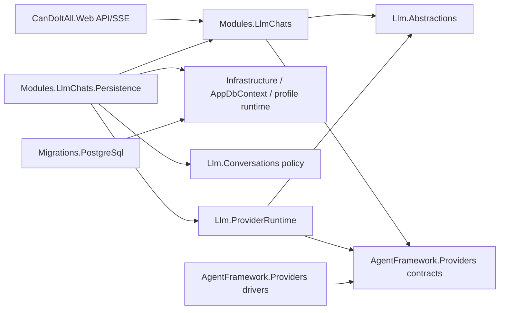

# C# boundary map

## Allowed direction

- Web depends on product contracts/application services.
- Persistence implements product ports and may depend on Infrastructure/EF.
- Product may depend on narrow provider-neutral types and provider read contracts.
- ProviderRuntime may depend on provider contracts/runtime.
- Provider driver projects never depend on product or Web.
- Migration project contains generated provider-specific assets only.

## Forbidden direction

- Product → Web/Razor/SSE writer.
- Product → EF Core/AppDbContext.
- Product → AgentFramework Core runtime, tools, skills, MCP, memory, processes.
- Provider drivers → Simple Chat types.
- Generic LLM abstractions → product or provider implementations.
- SSE transport → direct EF repositories.
- Background dispatcher → `HttpContext` or request-scoped cancellation.

## Contract ownership decisions

- `ILlmStreamingInvocationPort`: LLM abstractions.
- `IProviderStreamingChatCompletionDriver`: provider capability contracts.
- Product operation/event contracts: Modules.LlmChats.
- Durable event/lease repositories: product ports, persistence implementations.
- SSE cursor/serialization: Web generic streaming infrastructure.
