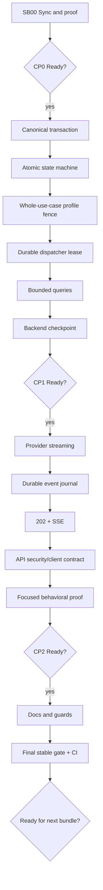

# Execution order and dependencies

## Critical foundations

- SB01–SB04 select data and execution semantics. Reopening any invalidates CP1 and all later proof.
- SB07 selects provider-streaming semantics. Reopening it invalidates event/SSE proof.
- SB08 selects durable event semantics. Reopening it invalidates reconnect and external-client proof.
- SB09 selects HTTP lifetime semantics. Reopening it invalidates API proof.

## Parallelism

No production subbundles are parallelized because each one selects the next protocol boundary.
Independent source inspection and test-fixture preparation may occur in parallel, but implementation
and closure stay sequential.
