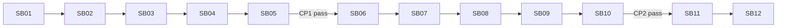

# Simple LLM Chats UI Integration

## Profile

- `initiative`

## Reviewed Baseline

- Repository: `fyziktom/CanDoItAll`
- Branch: `simple-chats`
- Reviewed head: `f61795c1cf6c6ccd9dcc8daae7c30caf82b901bc`
- UI reuse refactor bundle commit: `bca2c286d32c48ba0283a8f606f6cc5c8639afca`
- Backend closure commit: `eca249942211d9d8839f3e0da9b1997b7d652684`
- SharedInfo standards: `7b7808e8591d7219f40826cf0e5624e182981d90`

Execution must record the actual start commit and re-audit drift before editing.

## Review Verdict

The Agent Chat UI reuse refactor is architecturally sound and should be retained. A real backend-neutral Razor boundary exists, the Agent surfaces map into it through thin adapters, and the recorded component/browser proof plus the user's manual settings and Project Structure chat check are strong parity signals.

The branch is **ready for Simple Chat UI only after a short mandatory hardening phase**. CP1 blocks UI activation until the following gaps are closed:

1. predecessor proof/status/checksum claims are reconciled with ignored and absent proof artifacts;
2. presentation collections and keys become actual safe value snapshots;
3. active-list actions become source-neutral;
4. transient Assistant streaming and safe Markdown links are supported;
5. a conversation exposes the exact active operation id needed for reconnect.

This is not another broad component redesign. SB01-SB05 are bounded repairs. SB06-SB10 add the main Simple Chat UI. SB11 adds the unified floating catalog only after the main page passes CP2.

## Outcome Contract

At successful closure:

- existing Agent settings, main chat, floating chat, Process chat, and contextual Project Structure behavior remain unchanged;
- reusable components support both Agent and Simple Chat presentation without backend coupling;
- `/chats` provides definition management and durable multi-turn conversations;
- long responses stream through the existing durable event journal/session;
- browser refresh, reconnect, cancellation, replay gaps, profile changes, and recovery-required operations are handled without redispatch;
- the floating catalog offers `All / Agents / Chats` while keeping `Available / Active` as a separate axis;
- execution stops in `awaiting-user-simple-chat-ui-verification`, not automatic product approval.

## Scope Boundaries

This bundle intentionally does **not** implement Project Structure context, selected-node/subtree context, file/image attachments, voice, tools, skills, Memory, approvals, or public chatbot deployments. The neutral composer's `ContextActions` seam remains unused until a later typed context aggregate and Workbench adapter are designed.

## Execution Order



| Phase | Outcome | Gate |
|---|---|---|
| SB01-SB04 | proof and reusable/backend seam hardening | CP1 still locked |
| SB05 | Agent parity and architecture checkpoint | unlocks Simple Chat UI |
| SB06-SB09 | isolated UI boundary, definitions, conversations, streaming lifecycle | page remains unadvertised until complete |
| SB10 | activate `/chats`, navigation, and main-page browser proof | unlocks floating integration |
| SB11 | unified floating catalog and focused windows | CP3 |
| SB12 | one frozen-commit closure and user handoff | FINAL |

See `plan/01-phase-plan.md` and the numbered subbundle READMEs.

## Test Discipline

- Every source-changing subbundle uses `code_analytics_impacted_tests_get` from its actual diff and one-based changed line ranges.
- Inspected-but-unchanged files belong in `contextOnlyPaths`.
- Required selectors must discover the expected non-zero tests and all must run.
- Conditional selectors are promoted only when their recorded trigger occurs.
- No unfiltered Stable gate is allowed before SB12.
- SB12 may run the Stable gate once at one frozen commit because public shared UI contracts, module composition, navigation, and the app-level floating shell changed.
- Browser proof is targeted, at 1600x1000 or maximized desktop; do not run the whole Playwright suite by habit.

## Start Command

Read in this order:

1. `bundle-status.json`
2. `inputs/01-user-request.md`
3. `analysis/01-review-verdict.md`
4. `architecture/00-csharp-current-state-inventory.md`
5. `plan/01-phase-plan.md`
6. `subbundles/SB01-baseline-proof-and-user-regression-reconciliation/README.md`

Run:

```bash
python scripts/validate_all.py --stage prepared
```

Then execute only the current subbundle.
