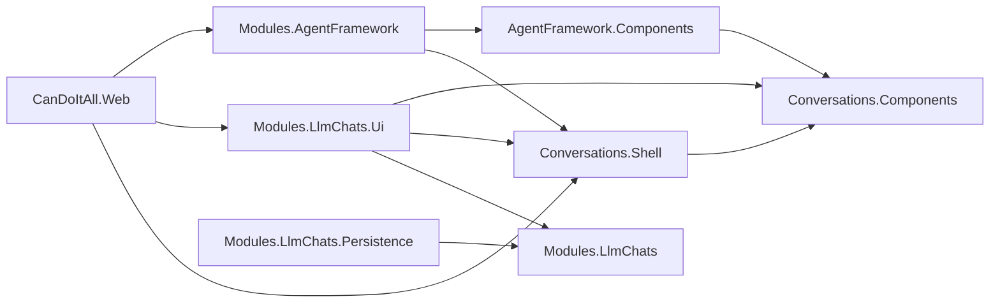

# C# Dependency Direction

## Required Direction

- `Conversations.Components` references no product project.
- `Conversations.Shell` references only reusable UI dependencies and `Conversations.Components`.
- `LlmChats.Ui` may reference `LlmChats`, `Conversations.Components`, `Conversations.Shell`, BaseLib/AppComponents, and narrowly justified prompt/navigation contracts.
- `LlmChats.Ui` must not reference `LlmChats.Persistence`, EF Core, `CanDoItAll.Web`, AgentFramework Core, Agent models, tools, skills, voice, or Memory.
- Agent modules may implement shell contributor contracts; the shell never points back to Agent modules.
- Web may compose both modules and the shell.

## Cycle Stop Rule

Any new project cycle or inward reference into Persistence/Web blocks the current subbundle. Do not repair a cycle with reflection, service location, or shared static state.
