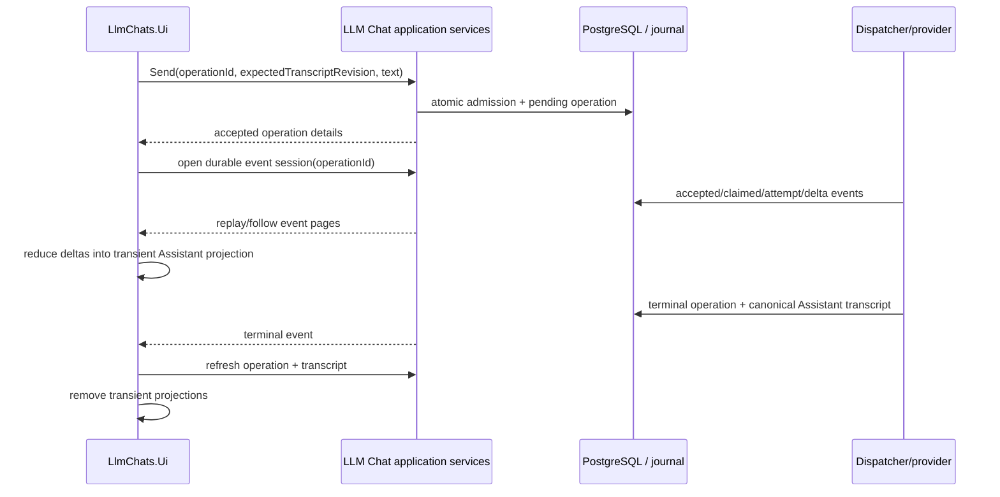

# Operation State And Streaming Flow

## Invariants

- The operation id is generated once per logical send and retained through retry/reconnect.
- Event cursor advances monotonically; duplicate events are idempotent.
- Partial output is display-only.
- A gap resets partial output and reloads canonical state.
- UI follower disposal never cancels the operation.
- Only explicit cancel invokes `ILlmChatOperationApplicationService.CancelAsync`.
- A profile change terminates the follower fail-closed and reloads from the new profile; it never mixes generations.
