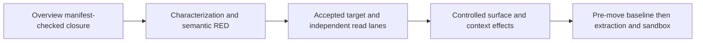

# Agent Governance state/read seams

Reference: **CDA-UI-SEAMS-AGENT-GOVERNANCE-01**. Status: **PREPARED ONLY; G00-G03 NOT EXECUTED**. No Governance production, test, project or asset edit is authorized by the current instruction.

Prepare a predictable read-only run inspector without changing execution, approvals or production routes. The current panel partially fences agent-list work but does not own manual run-detail lifetime. Keep its existing correct behavior, repair proven races in Module, then extract only the real controlled rendering closure after a fresh pre-move baseline.

The prerequisite [Overview closure receipt](proof/preparation/overview-entry-manifest-verification.json) passed at 2026-09-07 16:39:40 UTC. This preparation began afterward. Local/remote components-decoupling remains ad2ded645e65b8b205959f6fed816d082b99a7be with the tested, uncommitted Overview changes. [Entry state](proof/preparation/entry-state.json) identifies the necessary four-file Components patch and clean FileTools sibling. These are observations, not revision pins; rediscover before future execution.

Read [requirements](requirements.md), [adjudication](reviews/findings-adjudication.md), [boundary](architecture/01-csharp-boundary-map.md), [semantic test map](plan/semantic-test-map.md), [validation](plan/validation.md), [UI composition](plan/ui-composition.md) and [execution ledger](execution.md). [Preparation review](reviews/csharp-architecture-gate.md) assesses the plan, not future runtime results. [Traceability](traceability.md) maps every Phase C requirement.

Each child requires its own review, exact compiled discovery, proof and byte manifest before the next begins. G03 begins with baseline collection, not source movement. Overview/Capabilities/Catalog historical timings and tests are not Governance proof. Implementation needs a subsequent owner instruction.
