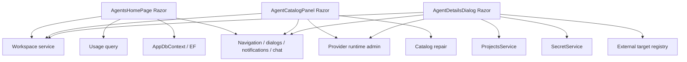
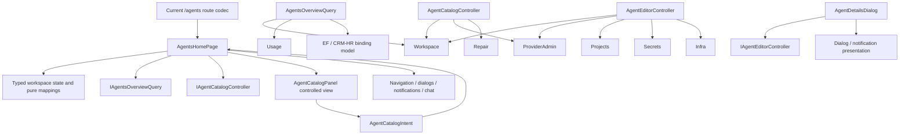

# C# dependency direction

## Current direction



The Razor layer points directly into several application, cross-module, and
infrastructure concerns.

## Target direction in the existing project



Dependencies move outward from Razor through three cohesive workflow contracts. The
implementation types remain in the current module for now.

## Future physical direction

After a later extraction bundle:

```text
CanDoItAll.Modules.AgentFramework.UI
    -> AgentFramework UI contracts/read models
    -> AppComponents
    -> shared Components/FileTools

CanDoItAll.Modules.AgentFramework (application/composition side)
    -> implements overview/catalog/editor contracts
    -> Workspace, ProviderManagement, Projects, Security, Infrastructure
```

This bundle must not add that project or change project references. It only makes the
future split possible.

## Cycle gate

No project-reference change is expected. Any new project reference or cycle is a bundle
repair trigger, not an implementation detail.
